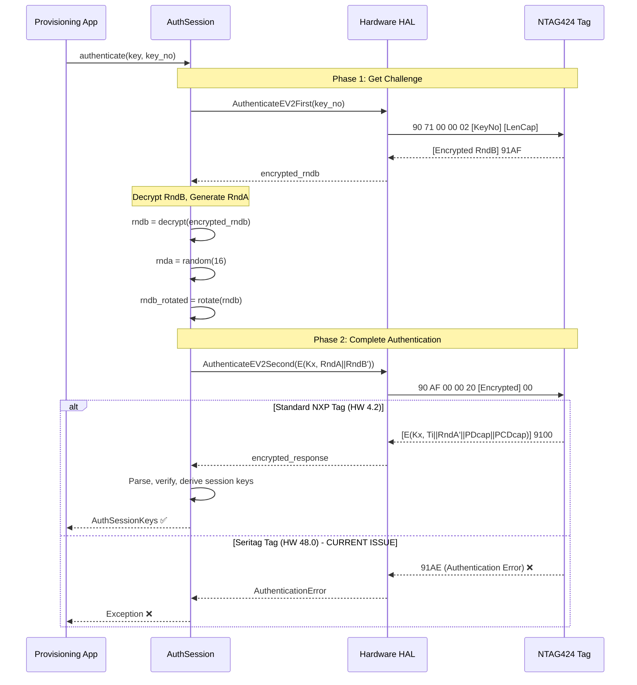

# NTAG424 SDM Provisioner - Implementation Plan

**TLDR;**: Game coin use case - NFC tags must serve authenticated URLs (UID+MAC+Counter) for server verification. **BREAKTHROUGH**: NDEF read/write works WITHOUT authentication on Seritag tags! Mock HAL created and verified to match real hardware exactly. SUN investigation next.

---

## Architecture Overview

### System Components

```
┌─────────────────────────────────────────────────────────────┐
│                    Provisioning Application                  │
│  (examples/05_provision_sdm.py, key_manager.py)            │
└──────────────────────┬──────────────────────────────────────┘
                        │
                        ▼
┌─────────────────────────────────────────────────────────────┐
│              Authentication & Session Management             │
│  (crypto/auth_session.py - EV2 protocol implementation)    │
└──────────────────────┬──────────────────────────────────────┘
                        │
        ┌───────────────┴───────────────┐
        │                               │
        ▼                               ▼
┌──────────────────┐          ┌──────────────────┐
│  Standard NXP    │          │  Seritag        │
│  NTAG424 DNA     │          │  NTAG424 DNA    │
│  (HW 4.2)        │          │  (HW 48.0)      │
│                  │          │                  │
│  ✅ Full EV2     │          │  ⚠️ Modified EV2│
│  ✅ SDM Support  │          │  ❌ Phase 2 Fail │
└──────────────────┘          └──────────────────┘
        │                               │
        └───────────────┬───────────────┘
                        │
                        ▼
┌─────────────────────────────────────────────────────────────┐
│            Command Layer (SDM Commands)                      │
│  (commands/sdm_commands.py - APDU command classes)        │
└──────────────────────┬──────────────────────────────────────┘
                        │
                        ▼
┌─────────────────────────────────────────────────────────────┐
│              Hardware Abstraction Layer (HAL)               │
│  (hal.py - PC/SC interface via pyscard)                     │
└──────────────────────┬──────────────────────────────────────┘
                        │
                        ▼
┌─────────────────────────────────────────────────────────────┐
│              NFC Reader (ACR122U, ACR1252U, etc.)           │
│                    → NTAG424 DNA Tag                       │
└─────────────────────────────────────────────────────────────┘
```

### Authentication Flow Sequence



---

## Current Status & Findings

### ✅ Working Components
1. **HAL Layer**: PC/SC communication works correctly
2. **Command Classes**: APDU command encapsulation complete
3. **EV2 Phase 1**: AuthenticateEV2First works for both standard and Seritag tags
4. **Version Detection**: GetChipVersion correctly identifies Seritag (HW 48.0)
5. **Session Key Derivation**: Key derivation algorithm implemented (not yet usable)

### ❌ Blocking Issues

#### **Primary Blocker: Seritag EV2 Phase 2 Authentication**
- **Symptom**: AuthenticateEV2Second returns `91AE` (Authentication Error)
- **Impact**: Cannot authenticate with Seritag tags → Cannot provision SDM
- **Root Cause**: Seritag uses modified Phase 2 protocol (unknown modification)
- **Investigation**: Active - analyzing Seritag documentation, testing protocol variations

#### **Secondary Blocker: Command 0x51 Discovery**
- **Finding**: Command 0x51 returns `91CA` (COMMAND_ABORTED) instead of `911C` (unsupported)
- **Implication**: Command exists and may enable recovery/reset functionality
- **Status**: Investigation ongoing - testing parameters and sequences
- **Requirement**: Need authentication to execute (chicken-egg problem)

### 📊 Test Infrastructure Status
- **Standard NXP Tags**: Tests working (when hardware available)
- **Seritag Tags**: Diagnostic scripts created, blocked by authentication failure
- **Simulator**: `seritag_simulator.py` implements standard EV2 (useful for testing our code, not Seritag behavior)

---

## Investigation Strategy

### Phase 1: Reverse Engineer Seritag Phase 2 Protocol ⏳ **IN PROGRESS**

**Goal**: Understand exactly how Seritag modifies the EV2 Phase 2 protocol

**Approach**:
1. ✅ **Document Analysis**: Review Seritag SVG authentication pages
   - Location: `investigation_ref/seritag_investigation_reference.md`
   - Status: Reference document prepared, needs deep analysis
   
2. ⏳ **Protocol Variation Testing**: Test all possible Phase 2 modifications
   - Different RndB rotation (left/right, byte count variations)
   - Different encryption modes/padding schemes  
   - Multi-frame responses
   - Timing delays between Phase 1 and Phase 2
   - Script: `seritag_phase2_analysis.py`
   
3. ⏳ **Error Code Analysis**: Understand exact failure mode
   - `91AE` = "Current authentication status does not allow the requested command"
   - May indicate protocol mismatch, not key error
   - Log exact response bytes for analysis

**Tools**:
- `examples/seritag/03_authenticate_seritag.py` - Authentication diagnostic
- `seritag_phase2_analysis.py` - Phase 2 protocol variations
- `seritag_recovery_attempts.py` - Alternative approaches

**Success Criteria**: 
- Successfully complete Phase 2 authentication with Seritag tag
- Obtain session keys and verify authentication state

---

### Phase 2: Exploit Command 0x51 🔍 **IN PROGRESS**

**Goal**: Understand and successfully execute command 0x51

**Status Word Analysis**:
- `91CA` = COMMAND_ABORTED: "Previous Command was not fully completed. Not all Frames were requested or provided by the PCD."
- **Critical Insight**: May need previous command sequence or multi-frame protocol

**Approach**:
1. ✅ **Command Discovery**: Confirmed command exists (returns 91CA, not 911C)
2. ⏳ **Parameter Exploration**: Systematic testing of P1/P2/Lc/Data combinations
   - Script: `seritag_0x51_exploit.py`
   - Test immediately after Phase 1 (before Phase 2)
   - Test as chained/multi-frame command
   - Test with different key numbers from Phase 1
3. ⏳ **Sequence Testing**: Try 0x51 as part of command sequences
   - After Phase 1 only
   - Between Phase 1 and Phase 2  
   - As alternative to Phase 2
4. ⏳ **Documentation Research**: Search Seritag docs for 0x51 reference

**Hypothesis**: 
- Command 0x51 might be Seritag's "Phase 2 equivalent"
- Command 0x51 might enable factory reset or protocol switching
- Command 0x51 might require specific preconditions

**Success Criteria**:
- Successfully execute 0x51 and receive non-error response
- If successful, attempt to use 0x51 to reset tag or complete authentication

---

### Phase 3: Alternative Authentication Methods 🔄 **PLANNED**

**Goal**: Find alternative paths to authenticate with Seritag tags

**Approaches**:
1. **EV1 Authentication**: Try legacy EV1 protocol instead of EV2
   - Different command codes
   - Different key derivation
   - May be supported for backward compatibility
   
2. **Factory Key Variations**: Test if Seritag uses different factory keys
   - Standard: All zeros (16 bytes)
   - Variations: Seritag-branded keys, UID-derived keys
   - Script: `seritag_recovery_attempts.py`
   
3. **Hardware Reset**: Physical/power cycling might reset to factory state
   - Remove and re-apply tag
   - Reader power cycle
   - May clear authentication state

4. **Low-Level APDU Manipulation**: Bypass high-level abstractions
   - Direct APDU construction
   - Experiment with unusual command formats

**Success Criteria**: Any method that successfully authenticates with Seritag tag

---

### Phase 4: Integration & Testing ✅ **PLANNED**

**Goal**: Integrate Seritag support into main provisioning workflow

**Tasks**:
1. **Protocol Detection**: Auto-detect Seritag vs. standard NXP (HW version check)
2. **Authentication Handler**: Create Seritag-specific authentication path
3. **Error Handling**: Graceful fallback when Seritag authentication fails
4. **Documentation**: Document Seritag differences and limitations
5. **Testing**: Validate full SDM provisioning on Seritag tags (once auth works)

---

## Component Details

### Authentication Session (`crypto/auth_session.py`)
- **Purpose**: Manages EV2 authentication and session key derivation
- **Current State**: Implements standard NXP EV2 protocol
- **Modification Needed**: Add Seritag-specific Phase 2 handler
- **Dependencies**: AES (pycryptodome), CMAC for key derivation

### Command Layer (`commands/sdm_commands.py`)
- **Purpose**: Encapsulates NTAG424 APDU commands
- **Current State**: Complete for standard commands
- **Enhancement**: Add command 0x51 wrapper when protocol understood

### Hardware Abstraction Layer (`hal.py`)
- **Purpose**: PC/SC interface abstraction
- **Current State**: Working correctly
- **No Changes Needed**: Hardware communication is functioning

### Key Manager (`key_manager.py`)
- **Purpose**: Derive unique keys per tag using UID
- **Current State**: Implemented, needs testing
- **Note**: Requires authentication to change keys (blocked by Phase 2 issue)

---

## Risk Assessment & Mitigation

### High Risk Operations
1. **FORMAT_PICC**: Will permanently erase tag (one-way operation)
   - **Mitigation**: Only test with expendable tags, explicit confirmation required
   
2. **Key Changes**: Changing keys without backup permanently locks tag
   - **Mitigation**: Always save keys before changing, test with dummy tags first
   
3. **Brute Force**: Too many auth attempts may trigger security delays
   - **Mitigation**: Add delays between attempts, monitor for rate limiting

### Low Risk Operations
- Phase 1 authentication attempts (read-only)
- Command probing (read-only exploration)
- Version detection (read-only)

---

## Next Immediate Steps

1. **Deep Analysis of Seritag Documentation**
   - Analyze SVG pages in `investigation_ref/`
   - Extract exact Phase 2 protocol differences
   - Document findings in analysis document

2. **Run Phase 2 Variation Tests**
   - Execute `seritag_phase2_analysis.py` with real hardware
   - Capture all error codes and responses
   - Log exact bytes for analysis

3. **Test Command 0x51 Immediately After Phase 1**
   - Execute `seritag_0x51_exploit.py` 
   - Focus on multi-frame/chained command patterns
   - Test with timing variations

4. **Update Constants**
   - Add missing status words (91CA, etc.) to `constants.py`
   - Document all observed Seritag-specific behaviors

5. **Create Seritag Authentication Handler**
   - Once Phase 2 protocol identified, implement handler
   - Support both standard and Seritag paths
   - Auto-detect based on hardware version

---

## Success Metrics

### Short-Term (Investigation Phase)
- [ ] Identify exact Seritag Phase 2 protocol difference
- [ ] Successfully complete authentication with Seritag tag
- [ ] Document command 0x51 behavior and requirements
- [ ] Create Seritag authentication handler implementation

### Long-Term (Integration Phase)
- [ ] Full SDM provisioning works on Seritag tags
- [ ] Automatic protocol detection (no manual configuration)
- [ ] Comprehensive test coverage for Seritag tags
- [ ] Recovery tool for locked Seritag tags
- [ ] Complete documentation of Seritag modifications

---

## Dependencies & Prerequisites

### Hardware Requirements
- ✅ PC/SC compliant NFC reader (ACR122U or equivalent)
- ✅ Seritag NTAG424 DNA tag (HW 48.0) for testing
- ✅ Standard NXP NTAG424 DNA tag (HW 4.2) for comparison

### Software Requirements  
- ✅ Python 3.8+ with venv
- ✅ pyscard (PC/SC interface)
- ✅ pycryptodome (AES/CMAC crypto)
- ✅ Investigation scripts and analysis tools

### Knowledge Requirements
- ✅ NXP NTAG424 DNA EV2 authentication protocol
- ✅ AES-128 encryption and CMAC
- ⏳ Seritag-specific protocol modifications (investigating)

---

**Last Updated**: Current session - Analysis complete, Phase 2 investigation active  
**Status**: Investigation phase - Blocked on Seritag Phase 2 protocol  
**Priority**: HIGH - Blocks SDM provisioning for Seritag tags (common variant)
