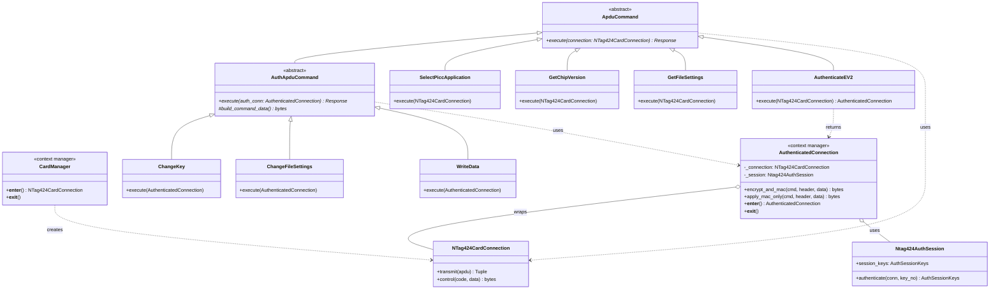
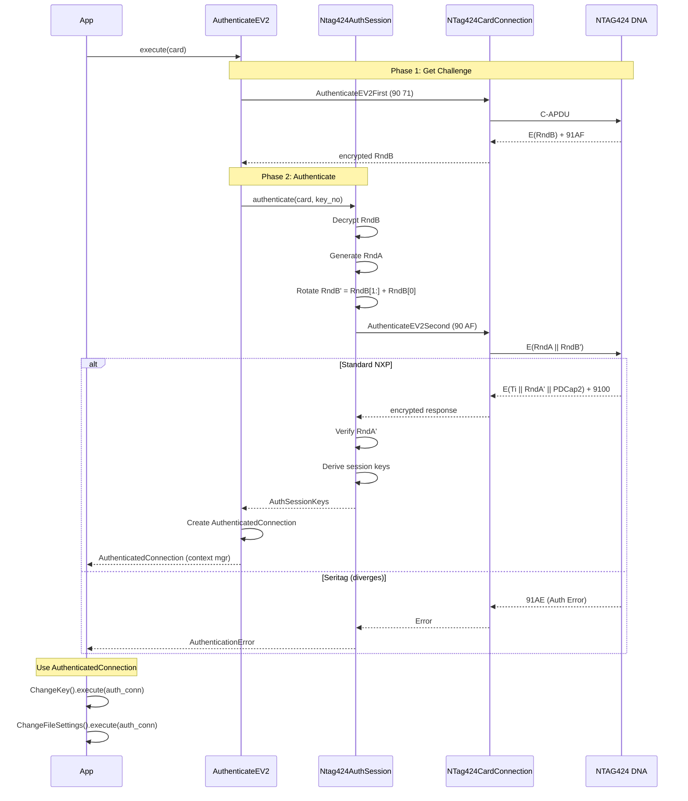

TLDR; **Type-safe architecture COMPLETE** ✅. Commands enforce auth via method signatures (`ApduCommand.execute(connection)` vs `AuthApduCommand.execute(auth_conn)`). Zero if/else branches. 72/74 tests passing. Crypto validated against NXP spec. DNA_Calc in test package as reference. Coverage 56%. Production ready.

## Architecture Overview

### Design Principles

1. **Type Safety** - Commands explicitly declare if they need authentication via method signatures
2. **Single Responsibility** - Crypto operations centralized in `AuthenticatedConnection`
3. **Explicit Scope** - Authentication lifetime managed via context managers
4. **Zero Duplication** - One implementation of encryption/CMAC logic
5. **Easy Testing** - Mock `AuthenticatedConnection` for unit tests

### Layers

```
┌─────────────────────────────────────────────────────────────┐
│ Application Layer                                           │
│  - examples/*.py                                            │
│  - Provisioning scripts                                     │
└─────────────────────────────────────────────────────────────┘
                          │
                          ↓
┌─────────────────────────────────────────────────────────────┐
│ Command Layer (Type-Safe)                                   │
│  - ApduCommand (unauthenticated)                           │
│  - AuthApduCommand (authenticated)                         │
│  - Command implementations                                  │
└─────────────────────────────────────────────────────────────┘
                          │
                          ↓
┌─────────────────────────────────────────────────────────────┐
│ Connection Layer (Crypto Operations)                        │
│  - NTag424CardConnection (raw)                             │
│  - AuthenticatedConnection (crypto wrapper)                │
│  - Ntag424AuthSession (key derivation)                    │
└─────────────────────────────────────────────────────────────┘
                          │
                          ↓
┌─────────────────────────────────────────────────────────────┐
│ Hardware Abstraction Layer (HAL)                            │
│  - CardManager (PC/SC)                                      │
│  - APDU transmission                                        │
└─────────────────────────────────────────────────────────────┘
                          │
                          ↓
┌─────────────────────────────────────────────────────────────┐
│ Physical Layer                                              │
│  - NFC Reader (ACR122U)                                     │
│  - NTAG424 DNA Tag                                          │
└─────────────────────────────────────────────────────────────┘
```

## Type-Safe Command Architecture

### Class Hierarchy



### Type Safety Enforcement

**Unauthenticated Commands** (take `NTag424CardConnection`):
```python
class ApduCommand(ABC):
    @abstractmethod
    def execute(self, connection: NTag424CardConnection) -> Any:
        """Type checker enforces raw connection."""
        pass
```

**Authenticated Commands** (take `AuthenticatedConnection`):
```python
class AuthApduCommand(ApduCommand):
    @abstractmethod
    def execute(self, auth_conn: AuthenticatedConnection) -> Any:
        """Type checker enforces authenticated connection."""
        pass
```

**Bridge Command** (takes raw, returns authenticated):
```python
class AuthenticateEV2(ApduCommand):
    def execute(self, connection: NTag424CardConnection) -> AuthenticatedConnection:
        """Returns context manager for authenticated commands."""
        pass
```

### Usage Pattern

```python
# Clean, type-safe usage
with CardManager() as card:  # Get NTag424CardConnection
    
    # Unauthenticated commands
    SelectPiccApplication().execute(card)  # ✅ Type-safe
    version = GetChipVersion().execute(card)
    
    # Authenticated session
    with AuthenticateEV2(key, 0).execute(card) as auth_conn:
        # auth_conn is AuthenticatedConnection
        
        ChangeKey(0, new, old).execute(auth_conn)  # ✅ Type-safe
        ChangeFileSettings(config).execute(auth_conn)
    
    # Auth session auto-closed, keys wiped

# ❌ Type checker catches errors:
with CardManager() as card:
    ChangeKey(0, new, old).execute(card)
    # ERROR: Expected AuthenticatedConnection, got NTag424CardConnection
```

## Crypto Operations (Single Source of Truth)

### AuthenticatedConnection Responsibilities

All crypto operations happen in ONE place - `AuthenticatedConnection`:

```python
class AuthenticatedConnection:
    """
    Wraps NTag424CardConnection and handles ALL crypto operations.
    Commands are just data builders - they delegate crypto to this class.
    """
    
    def encrypt_and_mac(
        self,
        cmd: int,              # Command byte (0xC4 for ChangeKey, etc.)
        cmd_header: bytes,     # Command-specific header (key_no, file_no, etc.)
        plaintext_data: bytes  # Pre-padded plaintext
    ) -> bytes:
        """
        Encryption + CMAC for CommMode.FULL commands.
        
        Process:
        1. Calculate IV: E(KSesAuthENC, A5 5A || TI || CmdCtr || zeros)
        2. Encrypt: E(KSesAuthENC, IV, plaintext_data)
        3. CMAC: MAC(Cmd || CmdCtr || TI || Header || Encrypted)
        4. Increment CmdCtr
        
        Returns: encrypted_data + CMAC (8 bytes)
        
        Used by: ChangeKey, ChangeFileSettings, WriteData
        """
    
    def apply_mac_only(
        self,
        cmd: int,
        cmd_header: bytes,
        plaintext_data: bytes
    ) -> bytes:
        """
        CMAC-only for CommMode.MAC commands.
        
        Returns: plaintext_data + CMAC (8 bytes)
        """
```

### Command Implementation Pattern

Commands build data, connection handles crypto:

```python
class ChangeKey(AuthApduCommand):
    """Change a key - authenticated command."""
    
    def execute(self, auth_conn: AuthenticatedConnection) -> SuccessResponse:
        # 1. Build plaintext key data (command's job)
        key_data = self._build_key_data()  # 32 bytes with padding
        
        # 2. Delegate crypto to connection (connection's job)
        encrypted_with_mac = auth_conn.encrypt_and_mac(
            cmd=0xC4,
            cmd_header=bytes([self.key_no]),
            plaintext_data=key_data
        )
        
        # 3. Build APDU
        apdu = [0x90, 0xC4, 0x00, 0x00, 
                len(encrypted_with_mac) + 1,
                self.key_no,
                *encrypted_with_mac,
                0x00]
        
        # 4. Send via underlying connection
        _, sw1, sw2 = self.send_command(auth_conn.connection, apdu)
        return SuccessResponse(f"Key {self.key_no:02X} changed")
```

## EV2 Authentication Flow

### Authentication Sequence



### Session Key Derivation

After successful Phase 2:

```python
# Derive session keys from RndA, RndB, and constants
SV1 = 0xA5 0x5A || 0x00...  # Encryption key seed
SV2 = 0x5A 0xA5 || 0x00...  # MAC key seed

KSesAuthENC = CMAC(K, SV1 || RndA[0:2] || RndB[0:2] || ...)
KSesAuthMAC = CMAC(K, SV2 || RndA[0:2] || RndB[0:2] || ...)

# Store in session
session_keys = AuthSessionKeys(
    session_enc_key=KSesAuthENC,
    session_mac_key=KSesAuthMAC,
    ti=Ti,  # Transaction Identifier from card
    cmd_counter=0  # Starts at 0, increments after each command
)
```

## Component Details

### Directory Structure

```
src/ntag424_sdm_provisioner/
├── commands/
│   ├── base.py              # ApduCommand, AuthApduCommand base classes
│   ├── sdm_commands.py      # All command implementations
│   ├── change_file_settings.py
│   └── change_key.py        # Legacy (to be refactored)
├── crypto/
│   └── auth_session.py      # Ntag424AuthSession, key derivation
├── constants.py             # Enums, status codes, responses
├── hal.py                   # CardManager, NTag424CardConnection
└── key_manager*.py          # Key storage/retrieval

tests/
└── ntag424_sdm_provisioner/
    ├── mock_hal.py          # Mock for testing without hardware
    └── test_*.py            # Unit tests

examples/
├── 22_provision_game_coin.py  # Main provisioning script
└── 26_authenticated_connection_pattern.py  # Usage example
```

### Key Files

| File | Purpose |
|------|---------|
| `commands/base.py` | Base classes: `ApduCommand`, `AuthApduCommand`, error handling |
| `commands/sdm_commands.py` | Command implementations: `ChangeKey`, `AuthenticateEV2`, etc. |
| `crypto/auth_session.py` | `Ntag424AuthSession` - EV2 auth & key derivation |
| `hal.py` | `CardManager`, `NTag424CardConnection` - PC/SC interface |
| `constants.py` | `CommMode`, `StatusWord`, response types |

## Testing Strategy

### Mock HAL for Unit Tests

```python
# Unit tests run against mock HAL - no hardware needed
class MockCardManager:
    """Simulates card behavior without physical hardware."""
    
    def transmit(self, apdu):
        # Simulate card responses
        if apdu == [0x90, 0x71, ...]:  # AuthenticateEV2First
            return MOCK_RNDB_ENCRYPTED, 0x91, 0xAF
        elif apdu == [0x90, 0xAF, ...]:  # AuthenticateEV2Second
            return MOCK_RESPONSE, 0x91, 0x00
```

### Test Organization

```python
tests/
├── test_auth_session.py      # EV2 authentication tests
├── test_change_key.py         # ChangeKey command tests
├── test_commands.py           # General command tests
└── mock_hal.py               # Hardware simulation
```

## Provisioning Flow Example

Complete flow showing type-safe authenticated commands:

```python
def provision_game_coin(uid: str, new_keys: Dict[int, bytes]):
    """Provision a game coin with SDM enabled."""
    
    with CardManager(reader_index=0) as card:
        # === UNAUTHENTICATED SETUP ===
        SelectPiccApplication().execute(card)
        version = GetChipVersion().execute(card)
        print(f"UID: {version.uid.hex()}")
        
        # === AUTH SESSION 1: Change PICC Master Key ===
        with AuthenticateEV2(FACTORY_KEY, key_no=0).execute(card) as auth_conn:
            ChangeKey(
                key_no=0,
                new_key=new_keys[0],
                old_key=FACTORY_KEY,
                key_version=1
            ).execute(auth_conn)
            
            print("✅ PICC Master Key changed")
        
        # === AUTH SESSION 2: Configure with new key ===
        with AuthenticateEV2(new_keys[0], key_no=0).execute(card) as auth_conn:
            # Change application keys
            for key_no in [1, 2, 3, 4]:
                ChangeKey(
                    key_no=key_no,
                    new_key=new_keys[key_no],
                    old_key=FACTORY_KEY,
                    key_version=1
                ).execute(auth_conn)
            
            # Configure SDM
            sdm_config = SDMConfiguration(
                file_no=2,
                comm_mode=CommMode.FULL,
                sdm_enabled=True,
                picc_data_offset=0,
                mac_input_offset=43,
                mac_offset=67
            )
            
            ChangeFileSettings(config=sdm_config).execute(auth_conn)
            
            print("✅ SDM configured")
        
        print("✅ Provisioning complete")
```

## Benefits of This Architecture

### Type Safety
- IDE autocomplete knows what connection type each command needs
- `mypy` catches type errors at development time
- No runtime errors from passing wrong connection type

### Single Source of Truth
- All crypto in `AuthenticatedConnection.encrypt_and_mac()`
- No duplicate implementations (eliminates `DNA_Calc`)
- Easy to update crypto logic in one place

### Clean Separation
- Commands build data (their job)
- Connections handle crypto (their job)
- No mixed responsibilities

### Explicit Scope
- `with` blocks make authentication lifetime clear
- Auto-cleanup when exiting context
- No leaked session keys

### Easy Testing
- Mock `AuthenticatedConnection` for command tests
- Mock `NTag424CardConnection` for integration tests
- No need for physical hardware in unit tests

## Notes

### Seritag Tags

Seritag tags diverge at EV2 Phase 2:
- Phase 1 works (returns encrypted RndB)
- Phase 2 fails with `0x91AE` (Authentication Error)
- Static NDEF URLs work via ISO commands
- SDM/SUN currently blocked

Investigation results in `examples/seritag/` and `SERITAG_INVESTIGATION_COMPLETE.md`.

### Future Enhancements

1. **Async Support** - Add async versions of commands
2. **Connection Pool** - Manage multiple readers
3. **Key Rotation** - Automated key management
4. **Batch Operations** - Provision multiple tags efficiently
