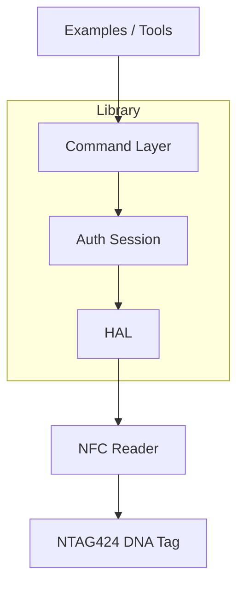

TLDR; Library structured as layered commands over a HAL; diagnostics and acceptance tests in `examples/seritag`; tests run against a mock HAL. Seritag tags diverge at EV2 Phase 2.

## Architecture Overview

### Layers

- Application scripts: `examples/` (`examples/seritag` for investigation)
- Library:
  - Command layer: `src/ntag424_sdm_provisioner/commands/*`
  - Auth/session: `src/ntag424_sdm_provisioner/crypto/auth_session.py`
  - HAL: `src/ntag424_sdm_provisioner/hal.py`
- Tests: `tests/` (with `mock_hal.py`)

### Components Diagram



### EV2 Authentication Sequence (Where Seritag Diverges)

```mermaid
sequenceDiagram
    participant App
    participant Auth
    participant HAL
    participant Tag

    App->>Auth: start_auth(key, key_no)
    Auth->>HAL: 90 71 (AuthenticateEV2First)
    HAL->>Tag: C-APDU
    Tag-->>HAL: E(RndB) 91AF
    Auth->>Auth: decrypt RndB; gen RndA; rotate RndB
    Auth->>HAL: 90 AF (AuthenticateEV2Second)

    alt Standard NXP
      Tag-->>HAL: E(Ti||RndA'...) 9100
      Auth-->>App: session keys derived
    else Seritag (observed)
      Tag-->>HAL: 91AE (Authentication Error)
      Auth-->>App: fail
    end
```

### Files of Interest

- `src/ntag424_sdm_provisioner/commands/sdm_commands.py` — core APDUs
- `src/ntag424_sdm_provisioner/crypto/auth_session.py` — EV2 auth
- `src/ntag424_sdm_provisioner/hal.py` — PC/SC transport
- `examples/seritag/*` — investigation & acceptance tests
- `tests/ntag424_sdm_provisioner/mock_hal.py` — mock hardware

### Notes

- Static NDEF URL works on Seritag via ISO commands without auth
- SDM/SUN requires auth; currently blocked due to Phase 2 failure

