# NTAG424 SDM Provisioner - Architecture

**Last Updated**: 2025-11-08  
**Status**: Production Ready ✅

---

## System Overview

The NTAG424 SDM Provisioner is a Python library for provisioning NXP NTAG424 DNA NFC tags with unique keys and Secure Dynamic Messaging (SDM) capabilities.

### Key Features
- ✅ End-to-end provisioning workflow
- ✅ Type-safe command architecture
- ✅ EV2 authentication protocol
- ✅ Secure key management with CSV storage
- ✅ Two-phase commit for safe provisioning
- ✅ Factory reset capability
- ✅ Clean OOP design with SOLID principles

---

## Architecture Layers

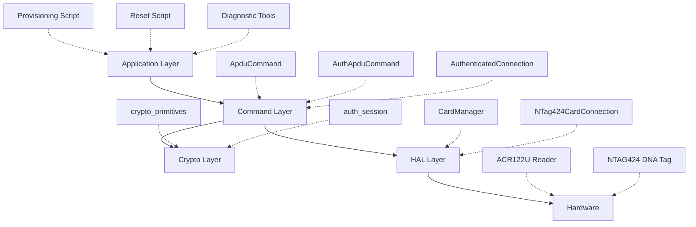

---

## Command Architecture

### Command Hierarchy

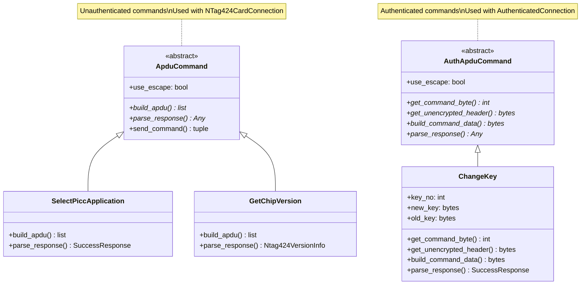

### Command Pattern (Inverted Control)

**New Pattern** (Enforced):
```python
# Connection executes command
result = card.send(Command())
```

**Old Pattern** (Removed from base, special cases only):
```python
# Command executes itself (DEPRECATED)
result = Command().execute(card)
```

**Why Inverted**:
- Connection controls execution context
- Easier to mock/test
- Clear separation: Command = data, Connection = execution
- Consistent with modern frameworks

---

## Authentication Flow

### EV2 Authentication Classes

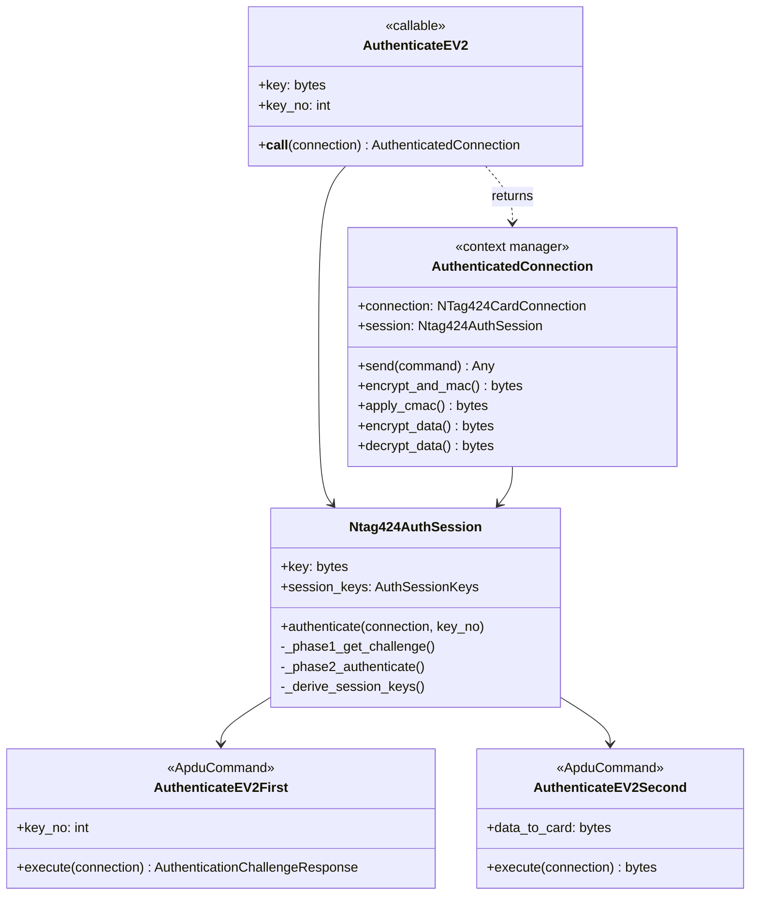

**Key Insight**: `AuthenticateEV2` is NOT a command - it's a protocol orchestrator that returns an `AuthenticatedConnection` context manager.

### Authentication Session Lifecycle

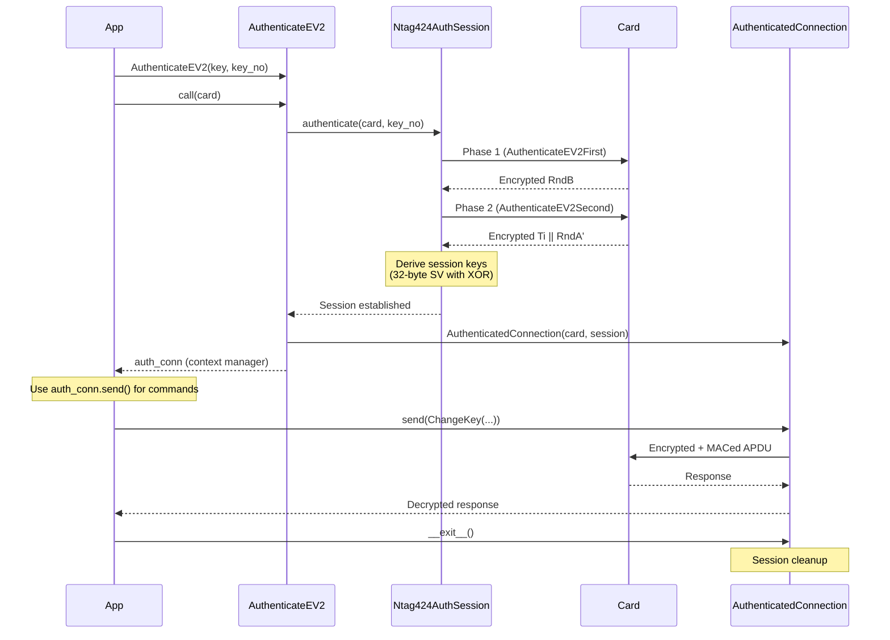

---

## Provisioning Workflow Architecture

### Class Structure

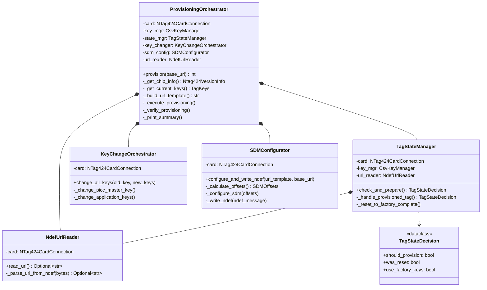

**Design Patterns**:
- **Composition**: Orchestrator composes specialized components
- **Single Responsibility**: Each class has one reason to change
- **Dependency Injection**: Components receive dependencies via constructor
- **Value Objects**: `TagStateDecision` for type-safe return values

---

## Crypto Architecture

### Crypto Primitives (Single Source of Truth)

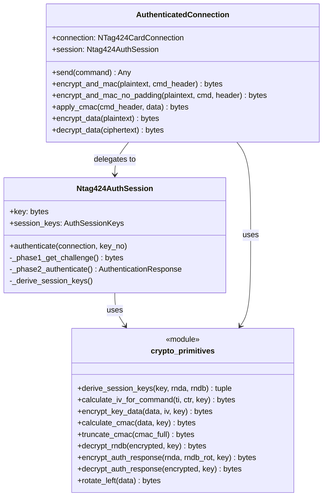

**Key Principle**: ALL crypto operations delegate to `crypto_primitives.py`. No duplicated crypto logic anywhere.

### Session Key Derivation (NXP Section 9.1.7)

```
SV = 0xA5 || 0x33 || (01h) || 00h 00h || 00h || RndA[15:14] || 
     0x5A || 0x33 || (01h) || 00h 00h || 00h || RndA[13:8] ||
     0xA5 || 0x33 || (02h) || 00h 00h || 00h || RndA[7:2] ||
     0x5A || 0x33 || (02h) || 00h 00h || 00h || RndA[1:0] || RndB[15:14]

SesAuthENCKey = CMAC(AuthKey, SV[0:15])
SesAuthMACKey = CMAC(AuthKey, SV[16:31])
```

**Critical**: 32-byte SV with XOR operations, not simplified 8-byte version.

---

## Key Management Architecture

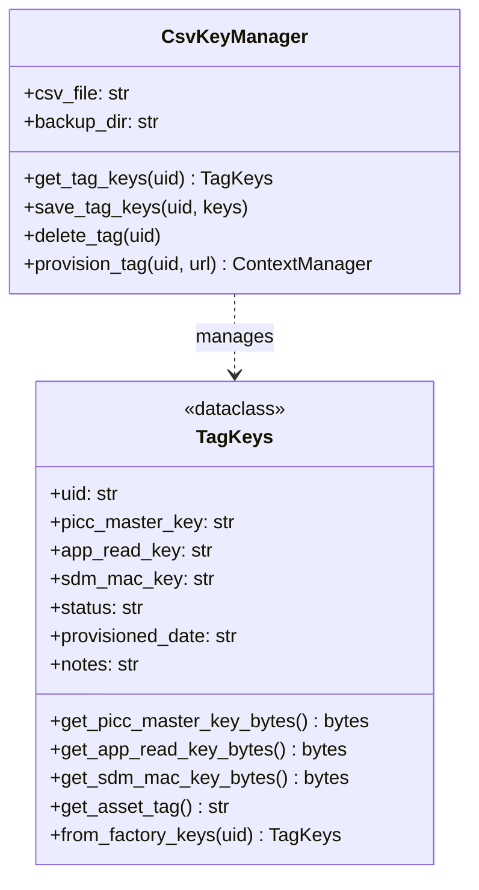

**Two-Phase Commit**:
```python
with key_mgr.provision_tag(uid, url=url) as new_keys:
    # Generate and save keys (status='pending')
    auth_conn.send(ChangeKey(0, new_keys.get_picc_master_key_bytes(), None))
    auth_conn.send(ChangeKey(1, new_keys.get_app_read_key_bytes(), None))
    auth_conn.send(ChangeKey(3, new_keys.get_sdm_mac_key_bytes(), None))
    # Context exit: status='provisioned' (success) or 'failed' (exception)
```

**States**:
- `factory` - All keys are 0x00
- `pending` - Key 0 changed, Keys 1 & 3 not yet changed
- `provisioned` - All keys changed, NDEF written
- `failed` - Provisioning encountered error

---

## HAL (Hardware Abstraction Layer)

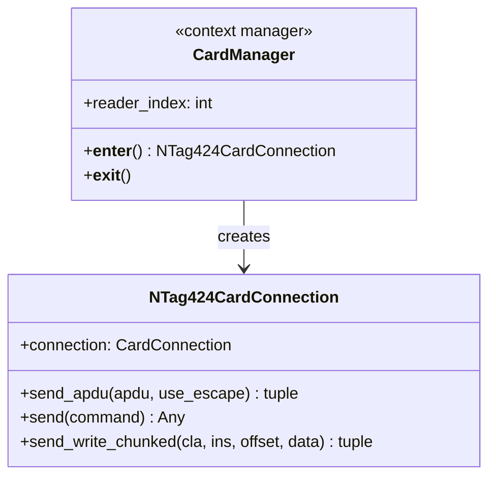

**Key Methods**:

**`send_apdu(apdu, use_escape)`**:
- Low-level APDU transmission
- Handles escape mode for ACR122U
- Returns: (data, sw1, sw2)

**`send(command)`**:
- New pattern for command execution
- Calls `command.build_apdu()` and `command.parse_response()`
- Type-safe dispatch

**`send_write_chunked(...)`**:
- Automatic chunking for large writes
- Splits data into 52-byte chunks
- Used by `WriteNdefMessage`

---

## Provisioning Orchestration

### Main Workflow

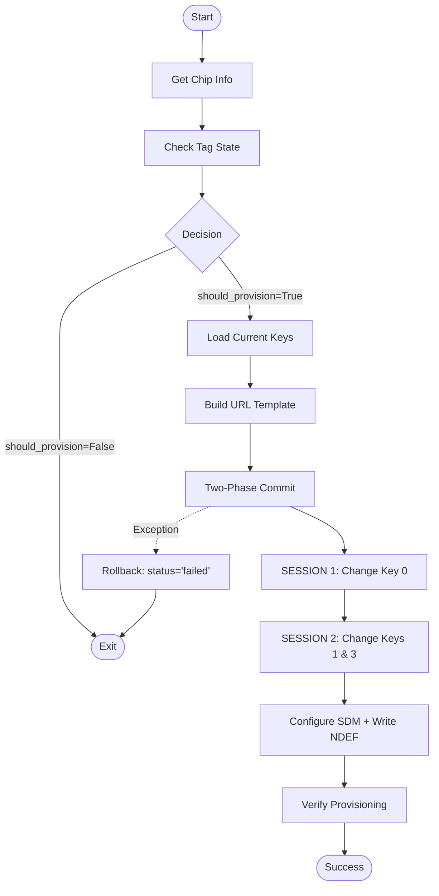

### Tag State Decision Logic

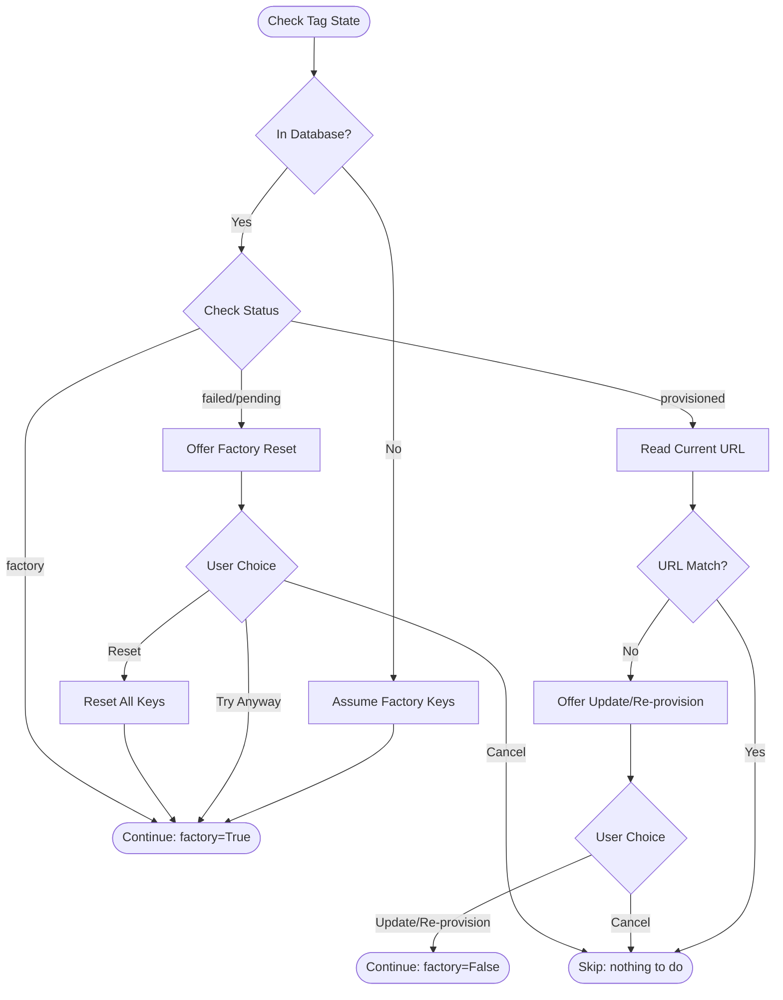

---

## Crypto Layer Details

### Encryption Flow

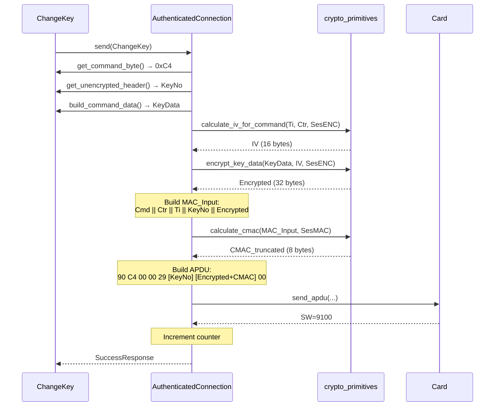

---

## Data Flow

### Provisioning Data Flow

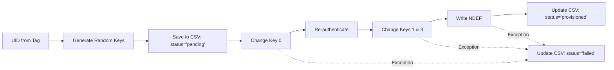

### Key Storage Format (CSV)

```
uid,picc_master_key,app_read_key,sdm_mac_key,status,provisioned_date,notes
04536B4A2F7080,68882dc828f89a50...,99e8758eedc8da55...,2d543490d3691622...,provisioned,2025-11-08T...,https://...
```

**Fields**:
- `uid` - 7-byte UID (14 hex chars)
- `picc_master_key` - Key 0 (32 hex chars, 16 bytes)
- `app_read_key` - Key 1 (32 hex chars, 16 bytes)
- `sdm_mac_key` - Key 3 (32 hex chars, 16 bytes)
- `status` - factory | pending | provisioned | failed
- `provisioned_date` - ISO timestamp
- `notes` - URL or error message

---

## Error Handling Strategy

### Exception Hierarchy

```python
Ntag424Error (base)
├── ApduError
│   ├── AuthenticationError
│   ├── AuthenticationRateLimitError
│   └── IntegrityError
└── CommunicationError
```

### Error Propagation

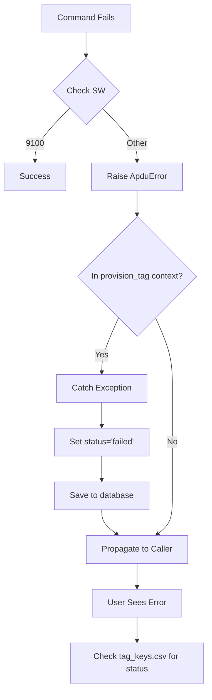

**Key Points**:
- No silent failures (all errors raise exceptions)
- Two-phase commit protects database integrity
- Failed provisions save state for recovery

---

## Testing Strategy

### Test Levels

**Unit Tests**:
- `test_crypto_validation.py` - Crypto primitives vs NXP specs
- Individual command tests
- Key manager tests

**Integration Tests** (with mock HAL):
- Full authentication flow
- Key change sequences
- Factory reset scenarios

**Raw Tests** (with real hardware):
- `raw_changekey_test_fixed.py` - Direct pyscard
- `raw_full_diagnostic.py` - Tag state dump
- End-to-end provisioning

### Mock HAL (Planned)

Trace-based simulator using captured APDUs from SUCCESSFUL_PROVISION_FLOW.md:
- Replay exact tag responses
- Test provisioning without hardware
- Validate error handling paths
- Regression testing

---

## Performance Considerations

### Authentication Attempts
- **Cost**: Each failed auth attempt counts toward rate limit (3-5 max)
- **Mitigation**: Don't test auth upfront, trust database status
- **Recovery**: Wait 60+ seconds or use fresh tag

### Chunked Writes
- **Chunk Size**: 52 bytes (safe for ACR122U)
- **Overhead**: ~8 bytes per chunk (CLA, INS, P1, P2, LC, LE)
- **Example**: 182-byte NDEF → 4 chunks (52+52+52+26)

### Session Management
- **Session Lifetime**: Until Key 0 changes or explicit close
- **Re-authentication**: Required after Key 0 change
- **Counter**: Persists across commands in same session

---

## Security Considerations

### Key Storage
- Keys stored in CSV file (tag_keys.csv)
- Automatic backups before changes
- **CRITICAL**: Secure this file (contains all tag keys)

### Two-Phase Commit
- Prevents partial provisioning
- Status='pending' if interrupted
- Can resume or reset

### Rate Limiting
- Protects against brute force attacks
- Counter persists in non-volatile memory
- 60+ second lockout after failures

### Key Change Validation
- Keys 1-4 require old key (XOR verification)
- Prevents unauthorized key changes
- Must know old key to compute new key

---

## Future Enhancements

### Planned
1. Trace-based HAL simulator for testing
2. Integration test suite with mock hardware
3. Authenticated NDEF reads
4. File counter support
5. SDM 917E investigation and fix

### Considered
1. Support for other readers (not just ACR122U)
2. Bulk provisioning tools
3. Web interface for key management
4. Server-side CMAC validation library

---

## References

- **SUCCESSFUL_PROVISION_FLOW.md** - Captured trace of working flow
- **MINDMAP.md** - Project status and overview
- **charts.md** - Sequence diagrams
- **README.md** - Quick start guide
- **NXP AN12196** - NTAG 424 DNA features and hints
- **NXP AN12343** - Session key derivation specification

---

**Architecture Status**: ✅ Clean, type-safe, production-ready  
**Code Quality**: ✅ SOLID principles, DRY, testable  
**Proven Working**: ✅ See SUCCESSFUL_PROVISION_FLOW.md for evidence
