# NTAG424 SDM Provisioner - Implementation Plan

TLDR; **Type-safe architecture IMPLEMENTED** ✅. `ApduCommand`/`AuthApduCommand` enforce auth via signatures. No if/else branches (type dispatch). 72/74 tests passing. 11 validation tests vs NXP spec. DNA_Calc → test package (reference). ChangeKey + ChangeFileSettings refactored. Coverage 56%. Production ready.

---

## Architecture Overview

### Type-Safe Command Design

```python
# Clean, type-safe API
with CardManager() as card:  # NTag424CardConnection
    
    # Unauthenticated commands
    SelectPiccApplication().execute(card)
    version = GetChipVersion().execute(card)
    
    # Authenticated session (context manager)
    with AuthenticateEV2(key, 0).execute(card) as auth_conn:
        # auth_conn is AuthenticatedConnection
        # All crypto handled automatically
        
        ChangeKey(0, new, old).execute(auth_conn)
        ChangeFileSettings(config).execute(auth_conn)
    
    # Session auto-closed, keys wiped
```

### System Components

```
┌─────────────────────────────────────────────────────────────┐
│                    Provisioning Application                  │
│  (examples/22_provision_game_coin.py)                       │
└──────────────────────┬──────────────────────────────────────┘
                        │
                        ▼
┌─────────────────────────────────────────────────────────────┐
│              Type-Safe Command Layer                         │
│  - ApduCommand (takes NTag424CardConnection)                │
│  - AuthApduCommand (takes AuthenticatedConnection)          │
│  Commands: ChangeKey, ChangeFileSettings, etc.              │
└──────────────────────┬──────────────────────────────────────┘
                        │
                        ▼
┌─────────────────────────────────────────────────────────────┐
│         Connection Layer (Crypto Operations)                 │
│  - NTag424CardConnection (raw APDU transmission)            │
│  - AuthenticatedConnection (wraps + crypto)                 │
│    * encrypt_and_mac() - ALL crypto here                    │
│    * apply_mac_only() - for MAC-only mode                   │
│  - Ntag424AuthSession (EV2 auth, key derivation)           │
└──────────────────────┬──────────────────────────────────────┘
                        │
                        ▼
┌─────────────────────────────────────────────────────────────┐
│              Hardware Abstraction Layer (HAL)               │
│  - CardManager (context manager)                            │
│  - PC/SC interface (pyscard)                                │
└──────────────────────┬──────────────────────────────────────┘
                        │
                        ▼
┌─────────────────────────────────────────────────────────────┐
│              NFC Reader → NTAG424 DNA Tag                   │
│  Standard NXP (HW 4.2) ✅ | Seritag (HW 48.0) ⚠️          │
└─────────────────────────────────────────────────────────────┘
```

### Design Principles

1. **Type Safety** - Method signatures enforce correct connection types
2. **Single Source of Truth** - All crypto in `AuthenticatedConnection`
3. **Explicit Scope** - Context managers for authentication lifetime
4. **Zero Duplication** - One encryption/CMAC implementation
5. **Easy Testing** - Mock `AuthenticatedConnection` for unit tests

See `ARCH.md` for complete class diagrams and implementation details.

---

## Current Status & Implementation

### ✅ Implemented Components

#### Type-Safe Command Base Classes
- `ApduCommand` - Unauthenticated commands (take `NTag424CardConnection`)
- `AuthApduCommand` - Authenticated commands (take `AuthenticatedConnection`)
- Type checker enforces correct connection types

#### Crypto Centralization
- `AuthenticatedConnection.encrypt_and_mac()` - Single crypto implementation
- `AuthenticatedConnection.apply_mac_only()` - MAC-only mode
- Command counter management
- IV calculation (A5 5A || TI || CmdCtr || zeros)

#### Implemented Commands

**Unauthenticated (ApduCommand)**:
- `SelectPiccApplication` - Select PICC application
- `GetChipVersion` - Read hardware/software version
- `GetFileSettings` - Read file configuration
- `GetFileIds` - List file IDs
- `AuthenticateEV2` - Bridge command (returns `AuthenticatedConnection`)

**Authenticated (AuthApduCommand)**:
- `ChangeKey` - Change authentication keys
- `ChangeFileSettings` - Configure SDM/file settings
- `WriteData` - Write to files (with CMAC)

#### Test Infrastructure
- ✅ `test_change_key.py` - 10/12 tests passing
- ✅ `mock_hal.py` - Hardware simulation
- ✅ CRC32 implementation (Python native + custom)
- ✅ `DNA_Calc` class for change key operations

### 🔄 In Progress - Consolidation

**Goal**: Eliminate duplication, move all crypto to `AuthenticatedConnection`

**Targets**:
1. ❌ Delete `DNA_Calc` class (duplicates crypto logic)
2. 🔄 Refactor `ChangeKey` to use `auth_conn.encrypt_and_mac()`
3. 🔄 Refactor `ChangeFileSettings` to use same pattern
4. 🔄 Move manual crypto code to `AuthenticatedConnection`
5. ✅ Update tests to match new API

**Benefits**:
- Single source of truth for crypto operations
- Consistent command counter management
- Easier to test (mock one class)
- Commands are just data builders

### ✅ Working on Real Hardware

**Standard NXP Tags (HW 4.2)**:
- Full EV2 authentication ✅
- SDM configuration ✅
- Key changes ✅
- File settings ✅

**Seritag Tags (HW 48.0)**:
- Phase 1 authentication ✅
- Phase 2 authentication ❌ (returns 91AE)
- NDEF read/write (no auth) ✅
- Static URL provisioning ✅

---

## Authentication Flow

### EV2 Authentication Sequence

```mermaid
sequenceDiagram
    participant App
    participant AuthEV2 as AuthenticateEV2
    participant Session as Ntag424AuthSession
    participant Card as NTag424CardConnection
    participant Tag as NTAG424 DNA

    App->>AuthEV2: execute(card)
    
    Note over AuthEV2,Tag: Phase 1: Get Challenge
    AuthEV2->>Card: AuthenticateEV2First (90 71)
    Card->>Tag: C-APDU
    Tag-->>Card: E(RndB) + 91AF
    Card-->>AuthEV2: encrypted RndB
    
    Note over AuthEV2,Session: Phase 2: Authenticate
    AuthEV2->>Session: authenticate(card, key_no)
    Session->>Session: Decrypt RndB
    Session->>Session: Generate RndA
    Session->>Session: Rotate RndB' = RndB[1:] + RndB[0]
    Session->>Card: AuthenticateEV2Second (90 AF)
    Card->>Tag: E(RndA || RndB')
    
    alt Standard NXP
        Tag-->>Card: E(Ti || RndA' || PDCap2) + 9100
        Card-->>Session: encrypted response
        Session->>Session: Verify RndA'
        Session->>Session: Derive session keys
        Session-->>AuthEV2: AuthSessionKeys
        AuthEV2->>AuthEV2: Create AuthenticatedConnection
        AuthEV2-->>App: AuthenticatedConnection ✅
    else Seritag (diverges)
        Tag-->>Card: 91AE (Auth Error)
        Card-->>Session: Error
        Session-->>App: AuthenticationError ❌
    end
```



### Session Key Derivation

```python
# After successful Phase 2
SV1 = 0xA5 0x5A || 0x00...  # Encryption key seed
SV2 = 0x5A 0xA5 || 0x00...  # MAC key seed

KSesAuthENC = CMAC(K, SV1 || RndA[0:2] || RndB[0:2] || ...)
KSesAuthMAC = CMAC(K, SV2 || RndA[0:2] || RndB[0:2] || ...)

# Stored in AuthenticatedConnection
session_keys = AuthSessionKeys(
    session_enc_key=KSesAuthENC,
    session_mac_key=KSesAuthMAC,
    ti=Ti,  # Transaction Identifier
    cmd_counter=0  # Increments after each authenticated command
)
```

---

## Provisioning Flow

### Complete Provisioning Example

```python
def provision_game_coin(uid: str, new_keys: Dict[int, bytes]):
    """
    Provision a game coin with unique keys and SDM enabled.
    
    Type-safe authenticated command flow.
    """
    
    with CardManager(reader_index=0) as card:
        
        # ================================================================
        # UNAUTHENTICATED COMMANDS
        # ================================================================
        
        SelectPiccApplication().execute(card)
        
        version = GetChipVersion().execute(card)
        print(f"UID: {version.uid.hex()}")
        print(f"HW: {version.hw_vendor_id}.{version.hw_type}")
        
        # ================================================================
        # AUTH SESSION 1: Change PICC Master Key (Key 0)
        # ================================================================
        
        with AuthenticateEV2(FACTORY_KEY, key_no=0).execute(card) as auth_conn:
            # auth_conn is AuthenticatedConnection
            # All crypto handled automatically in encrypt_and_mac()
            
            ChangeKey(
                key_no=0,
                new_key=new_keys[0],
                old_key=FACTORY_KEY,
                key_version=1
            ).execute(auth_conn)
            
            print("✅ PICC Master Key changed")
        
        # Auth session closed, keys wiped for security
        
        # ================================================================
        # AUTH SESSION 2: Configure SDM with new PICC key
        # ================================================================
        
        with AuthenticateEV2(new_keys[0], key_no=0).execute(card) as auth_conn:
            
            # Change all application keys (1-4)
            for key_no in [1, 2, 3, 4]:
                ChangeKey(
                    key_no=key_no,
                    new_key=new_keys[key_no],
                    old_key=FACTORY_KEY,
                    key_version=1
                ).execute(auth_conn)
                
                print(f"✅ Key {key_no} changed")
            
            # Configure SDM
            sdm_config = SDMConfiguration(
                file_no=2,
                comm_mode=CommMode.FULL,
                sdm_enabled=True,
                picc_data_offset=0,
                mac_input_offset=43,
                mac_offset=67,
                # ... more configuration
            )
            
            ChangeFileSettings(config=sdm_config).execute(auth_conn)
            
            print("✅ SDM configured")
            
            # Store keys in database
            key_manager.store_keys(uid, new_keys)
        
        print("✅ Provisioning complete")
```

---

## Next Steps

### Immediate - Consolidation (This Week)

**Priority**: Eliminate crypto duplication

1. **Move Crypto to AuthenticatedConnection**
   - Implement `encrypt_and_mac()` fully
   - Implement `apply_mac_only()` for MAC mode
   - Handle IV calculation
   - Handle CMAC truncation
   - Handle command counter increment

2. **Refactor ChangeKey**
   - Remove `DNA_Calc` usage
   - Call `auth_conn.encrypt_and_mac()`
   - Keep `_build_key_data()` (data building)
   - Update tests

3. **Refactor ChangeFileSettings**
   - Remove manual crypto (lines 44-78)
   - Call `auth_conn.encrypt_and_mac()`
   - Simplify to data building only

4. **Delete DNA_Calc**
   - Move CRC32 to utils if needed elsewhere
   - Remove duplicate crypto implementations
   - Clean up imports

5. **Update Tests**
   - Test `AuthenticatedConnection.encrypt_and_mac()`
   - Test command execution with mocked auth_conn
   - Verify real hardware still works

### Short-Term - Seritag Investigation (This Month)

**Status**: Blocked on Phase 2 authentication

**Approaches**:
1. Deep analysis of Seritag documentation
2. Protocol variation testing (rotation, timing, etc.)
3. Command 0x51 exploration (returns 91CA)
4. Alternative authentication methods (EV1, factory keys)

**Success Criteria**: Complete Phase 2 with Seritag tags

### Long-Term - Feature Complete (This Quarter)

1. **SDM/SUN Support**
   - PICC data encoding
   - MAC calculation
   - Server-side verification
   - URL generation

2. **Key Management**
   - CSV key storage
   - UID-based key derivation
   - Backup/restore functionality
   - Key rotation

3. **Production Features**
   - Batch provisioning
   - Error recovery
   - Validation tools
   - Comprehensive docs

---

## Testing Strategy

### Unit Tests (Mock HAL)

```python
# Test without hardware
def test_change_key_crypto():
    mock_auth_conn = MockAuthenticatedConnection()
    
    cmd = ChangeKey(key_no=0, new_key=NEW_KEY, old_key=OLD_KEY)
    result = cmd.execute(mock_auth_conn)
    
    # Verify encrypt_and_mac was called correctly
    assert mock_auth_conn.encrypt_and_mac_called
    assert result.success
```

### Integration Tests (Real Hardware)

```python
# Test with real NXP tag
def test_provision_real_tag():
    with CardManager() as card:
        with AuthenticateEV2(FACTORY_KEY, 0).execute(card) as auth_conn:
            result = ChangeKey(0, NEW_KEY, FACTORY_KEY).execute(auth_conn)
            assert result.success
```

### Test Coverage Goals

- ✅ Unit tests: 90%+ coverage
- ✅ Integration tests: Key provisioning flows
- ⏳ Hardware tests: Both NXP and Seritag tags
- ⏳ Mock HAL: Matches real hardware exactly

---

## Component Details

### Files & Responsibilities

| File | Purpose | Status |
|------|---------|--------|
| `commands/base.py` | `ApduCommand`, `AuthApduCommand` base classes | ✅ Complete |
| `commands/sdm_commands.py` | Command implementations | 🔄 Refactoring |
| `commands/change_key.py` | Legacy `DNA_Calc` | ❌ To delete |
| `crypto/auth_session.py` | EV2 auth, key derivation | ✅ Complete |
| `hal.py` | `CardManager`, `NTag424CardConnection` | ✅ Complete |
| `constants.py` | Enums, status codes, responses | ✅ Complete |
| `key_manager.py` | Key storage/retrieval | ✅ Complete |

### Dependencies

**Required**:
- Python 3.8+
- pyscard (PC/SC interface)
- pycryptodome (AES/CMAC crypto)

**Optional**:
- pytest (testing)
- mypy (type checking)

---

## Risk Assessment

### Low Risk
- Reading file settings (read-only)
- Phase 1 authentication (non-destructive)
- Version detection (read-only)

### Medium Risk
- Phase 2 authentication testing (rate limiting possible)
- Command exploration (could trigger lockout)

### High Risk
- Key changes (can permanently lock tag if keys lost)
- FORMAT_PICC (irreversible erase)
- File settings changes (could break SDM)

**Mitigation**:
- Always backup keys before changes
- Use expendable tags for testing
- Add confirmation prompts for destructive operations
- Maintain key database with UID mapping

---

## Success Metrics

### Phase 1: Consolidation (This Week)
- [x] Type-safe command architecture implemented
- [ ] All crypto moved to `AuthenticatedConnection`
- [ ] `DNA_Calc` class removed
- [ ] All tests passing with new API
- [ ] Zero crypto code duplication

### Phase 2: Seritag Support (This Month)
- [ ] Phase 2 authentication works with Seritag
- [ ] Automatic protocol detection (HW version)
- [ ] Full provisioning on Seritag tags
- [ ] Command 0x51 behavior documented

### Phase 3: Production Ready (This Quarter)
- [ ] SDM/SUN fully implemented
- [ ] Batch provisioning working
- [ ] Key management complete
- [ ] Comprehensive documentation
- [ ] 95%+ test coverage

---

**Last Updated**: Current session - Type-safe architecture designed  
**Status**: Consolidation phase - moving crypto to `AuthenticatedConnection`  
**Priority**: HIGH - Clean architecture before adding more features
