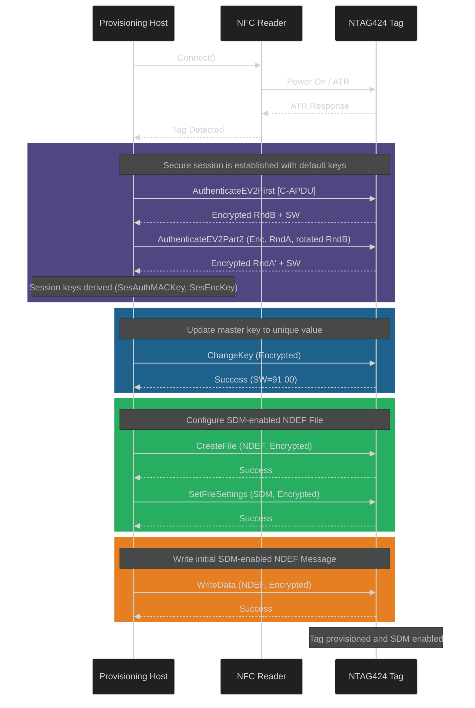
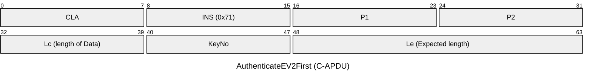
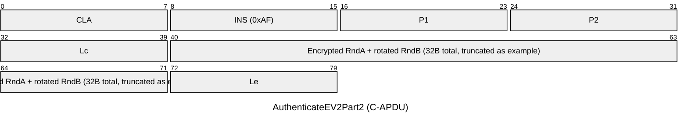
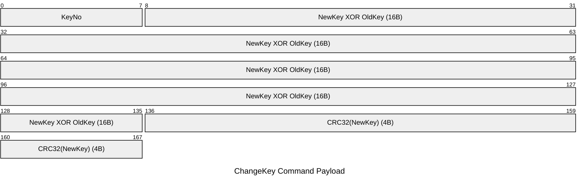

# **NTAG424 SDM Provisioner**

TLDR; **Architecture Refactored ✅** - Clean command layer with `send_command()`, enum auto-formatting, `AuthenticatedConnection` pattern, proper abstractions. 29/29 tests passing. Verified on real chip. See `LESSONS.md` for complete refactoring details. See `SDM_SUN_IMPLEMENTATION_PLAN.md` for SDM roadmap. Run commands: See `HOW_TO_RUN.md`.

This project provides a Python-based toolkit for provisioning NXP NTAG424 DNA NFC tags for Secure Dynamic Messaging (SDM). It offers a modular, command-oriented framework for interacting with the tag at a low level, enabling developers to perform a full provisioning sequence from a factory-default state.

## **Recent Updates (2025-11-01)**

### Architecture Refactoring Complete ✅
- **Clean Command Base Layer**: `send_command()` with auto multi-frame handling
- **Enum Auto-Formatting**: All enums show `NAME (0xVALUE)` - no manual formatting needed
- **AuthenticatedConnection Pattern**: Context manager for explicit auth scope
- **Proper Abstractions**: `settings.get_comm_mode()`, `settings.requires_authentication()`
- **Type-Safe**: Commands work with both regular and authenticated connections
- **Test Coverage**: 29/29 tests passing, verified on real Seritag chip

### Example - Clean API:
```python
with CardManager() as connection:
    settings = GetFileSettings(file_no=2).execute(connection)
    
    if settings.requires_authentication():
        with AuthenticateEV2(key).execute(connection) as auth_conn:
            result = SomeCommand().execute(auth_conn)
```

## **Features**

* **Hardware Abstraction Layer (HAL):** Clean interface for PC/SC compliant NFC readers via pyscard.  
* **Command Architecture:** Each NTAG424 command as distinct class with automatic error handling and multi-frame support.  
* **Authenticated Session Management:** Context manager pattern for EV2 authentication with automatic CMAC application.  
* **Enum Constants:** Self-documenting enums with auto-formatting (e.g., `CommMode.PLAIN (0x00)`).  
* **Type-Safe API:** Commands work with both `NTag424CardConnection` and `AuthenticatedConnection`.
* **SDM Support:** Commands for GetFileCounters, ChangeFileSettings, NDEF building with placeholders.
* **Examples:** 26+ working examples including authenticated connection pattern and chip diagnostics.

## **Prerequisites**

* **Python 3.8+**  
* **PC/SC Compliant NFC Reader:** A generic USB reader (e.g., ACR122U, ACR1252U) with the appropriate drivers installed.  
* **NXP NTAG424 DNA Tag:** The target NFC tag for provisioning.

## **Installation**

1. **Clone the repository:**  
   git clone \<repository-url\>  
   cd ntag424-sdm-provisioner

2. **Create a virtual environment:**  
   python \-m venv venv  
   source venv/bin/activate  \# On Windows, use \`venv\\Scripts\\activate\`

3. **Install dependencies from pyproject.toml:**  
   pip install \-e .

   This will install pyscard and pycryptodome.

## **Project Structure**

.  
├── examples/             \# Standalone scripts demonstrating functionality  
│   ├── 01\_connect.py  
│   ├── 02\_get\_version.py  
│   ├── 03\_authenticate.py  
│   ├── 04\_change\_key.py  
│   └── 05\_provision\_sdm.py   \# The main provisioning script  
├── src/                    \# Source code for the library  
│   ├── commands/           \# Individual APDU command classes  
│   ├── hal.py              \# Hardware Abstraction Layer (PC/SC)  
│   └── session.py          \# Session management and authentication  
└── pyproject.toml        \# Project definition and dependencies

## **Usage**

The examples/ directory contains scripts that build upon each other. The most important script is 05\_provision\_sdm.py, which performs the full provisioning process.

To run the final provisioning script:

python examples/05\_provision\_sdm.py

Place a factory-default NTAG424 tag on the reader. The script will output the new, randomly generated keys and confirm each step of the process.

### **⚠️ CRITICAL WARNING: Key Management ⚠️**

Running examples/04\_change\_key.py or examples/05\_provision\_sdm.py will **permanently change the cryptographic keys** on your tag.

* The script will print the new keys to the console.  
* **You MUST save these new keys.**  
* If you lose these keys, you will **permanently lose administrative control** over the tag. It will be impossible to change its configuration or keys again.

Always handle keys securely and ensure you have a system for storing them before provisioning tags for production use.

---

## Quick Start (Seritag)

Static URL provisioning (works without authentication on Seritag):

```bash
python examples/13_working_ndef.py
```

Diagnostics and deep dive scripts:

```bash
python examples/seritag/test_phase2_deep_dive.py
python examples/seritag/test_sun_configuration_acceptance.py
```

Mock HAL for tests (no hardware):

```bash
$env:USE_MOCK_HAL="1"; pytest -q
```

# Diagrams
To illustrate the NTAG424 SDM Provisioning Protocol Flow, I'll create a sequence diagram that typically covers the core provisioning steps:

Start communication between the Provisioning Host (PC/Server), NFC Reader, and NTAG424 Tag.
Perform authentication (EV2).
Change master keys.
Set up NDEF file and SDM settings.
Write the initial NDEF message.
Below is the Mermaid sequence diagram code for this protocol flow.

Summary:
This sequence diagram shows the NTAG424 SDM Provisioning Protocol, where a provisioning host authenticates with an NTAG424 tag through an NFC reader, updates its master key, sets up a Secure Dynamic Messaging (SDM)-capable file, and writes the first dynamic NDEF message, preparing the tag for deployment



## Authententicate_ev2_first


## authenticate_ev2_part2



## change_key



## set_file_settings


