Provisioning an NTAG 424 DNA for authenticated URLs is a more advanced process that involves not just writing data, but also configuring the tag's security features. The ACR122U reader acts as the bridge to send these specific configuration commands.

Here is a sequence diagram that demonstrates the typical workflow for provisioning an NTAG 424 DNA tag to generate a secure URL with a CMAC (Card Message Authentication Code) for tamper evidence.

### NTAG 424 Provisioning Sequence Diagram

This diagram outlines the steps an application would take using the ACR122U reader to configure an NTAG 424 DNA tag for generating secure, authenticated URLs.


## NTAG424 DNA SDM Provisioning Flow

### Complete SDM Provisioning Sequence

This diagram shows the complete workflow for provisioning an NTAG424 DNA tag for Secure Dynamic Messaging.

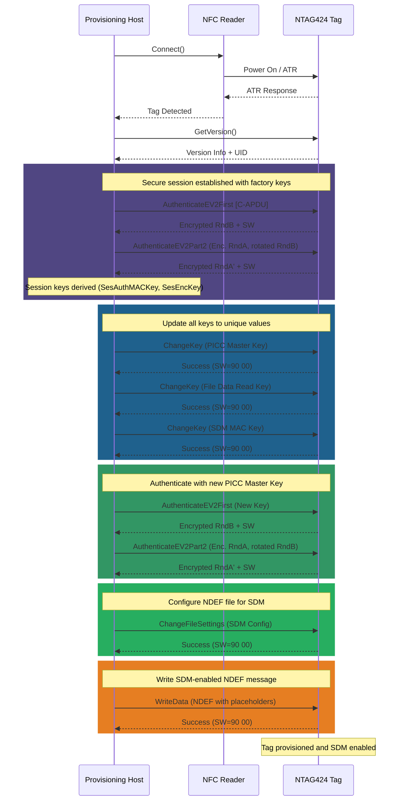

### Explanation of the Provisioning Steps:

1.  **Connect to Tag**: The application establishes a connection with the NTAG 424 DNA via the ACR122U reader.
2.  **Authenticate with Factory Keys**: To make any changes, the application must first authenticate using the tag's default, pre-set keys.
3.  **Change Keys**: For security, the default keys are immediately changed to new, secret keys known only to the provisioning application or system. This prevents unauthorized personnel from re-configuring the tag.
4.  **Write NDEF URL Template**: A URL is written to the tag's NDEF memory. This URL is a template that includes placeholders where the tag will automatically insert its unique ID (UID) and the security code (CMAC) when it is tapped.
5.  **Enable SUN Feature**: The application sends a command to the tag to activate its "Secure Unique NFC" (SUN) feature. This configures the tag to dynamically generate a CMAC based on its secret key and a tap counter each time it's read. It also enables the UID mirroring feature, which tells the tag to insert this data into the URL placeholders.

After these steps, when a user taps the provisioned tag with their phone, the NTAG 424 automatically generates the full URL with the unique UID and a fresh CMAC, which can then be verified by a server to prove the tag's authenticity.

# ACR122U API Mermaid Diagrams

This document contains Mermaid-formatted sequence and packet diagrams for the messages and structures found in the ACR122U API documentation.

## Chapter 3: PICC Interface Description

### ATR Format for ISO 14443 Part 3 PICCs

This diagram shows the structure of the Answer to Reset (ATR) message for ISO 14443-3 tags.

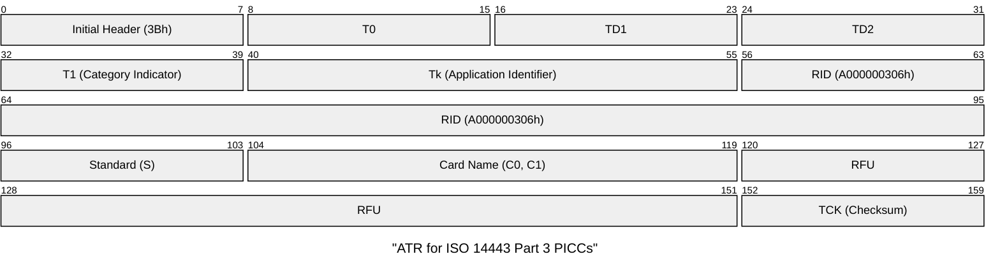

### ATR Format for ISO 14443 Part 4 PICCs

This diagram shows the structure of the ATR for ISO 14443-4 tags.

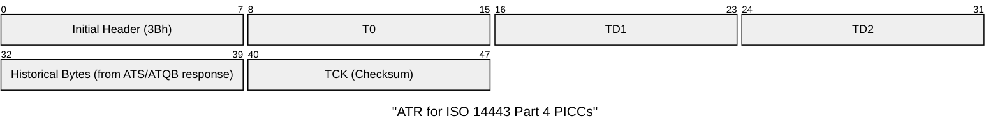

## Chapter 4: PICC Commands for General Purposes

### Get Data Command (APDU)

This command is used to retrieve the Unique ID (UID) or Answer to Select (ATS) from a tag.

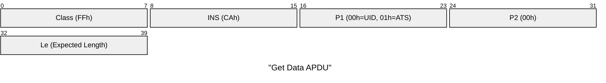

### Get Data Response

This is the response structure containing the requested UID or ATS.


## Chapter 5: PICC Commands for MIFARE Classic

### Load Authentication Keys Command (APDU)

This command loads an authentication key into the reader's volatile memory.

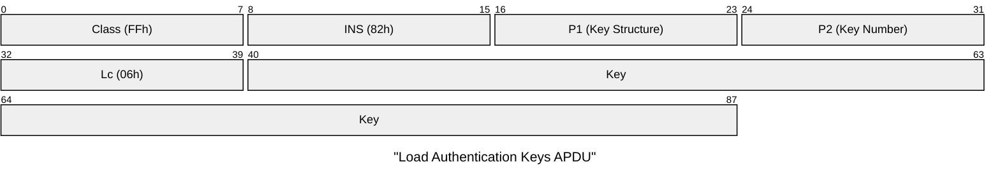

### Authentication Command (APDU)

This command performs authentication with a MIFARE Classic card sector using a previously loaded key.

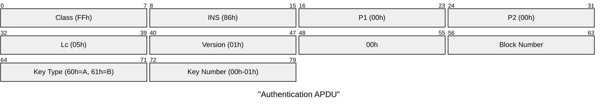

### Read Binary Blocks Command (APDU)

This command reads data from a memory block after successful authentication.


### Read Binary Blocks Response


### Update Binary Blocks Command (APDU)

This command writes data to a memory block after successful authentication.

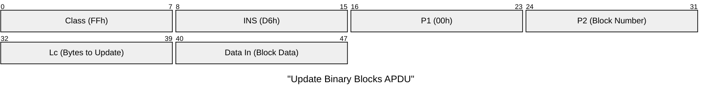

## Chapter 6: Pseudo-APDU Commands

### Direct Transmit Command

This command sends a raw payload to a non-PC/SC tag.

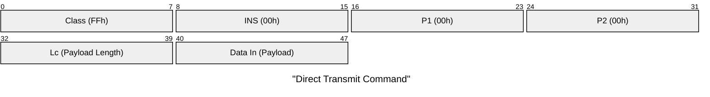

### Bi-color LED and Buzzer Control Command

This command provides control over the reader's peripherals.

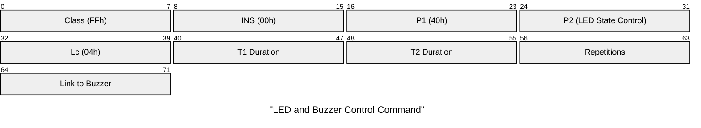

### P2: LED State Control Bitfield

This diagram shows the bit assignments for the `P2` byte in the LED/Buzzer control command.

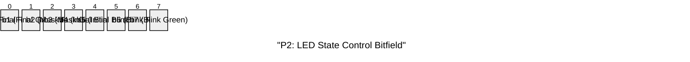

### Get Firmware Version Command

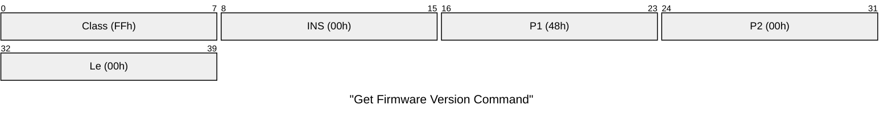

### Set PICC Operating Parameter Command

This command configures how the reader polls for different card types.

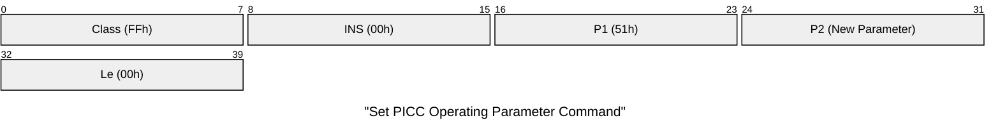

### PICC Operating Parameter Bitfield

This diagram details the bit assignments for the PICC operating parameter.


## Chapter 7: Communication Flows

### Accessing a FeliCa Tag

This sequence diagram illustrates the process of reading from a FeliCa tag.

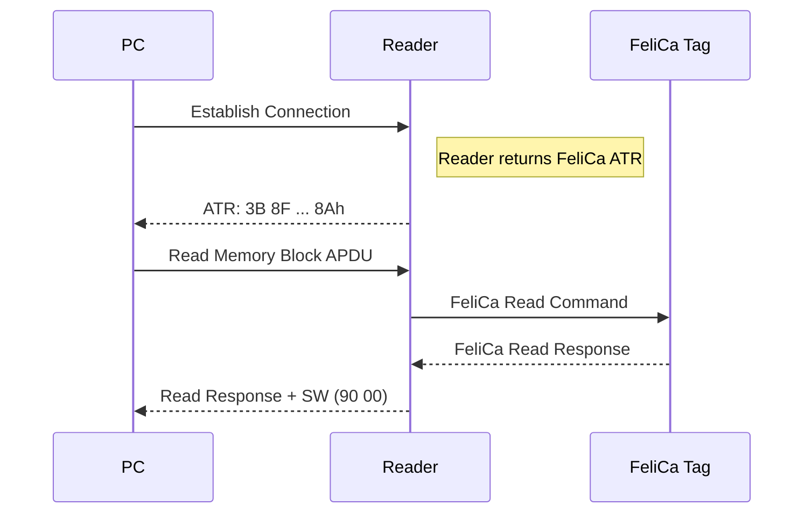

### Accessing a Topaz Tag (NFC Forum Type 1)

This sequence shows how to connect to, read from, and write to a Topaz tag.

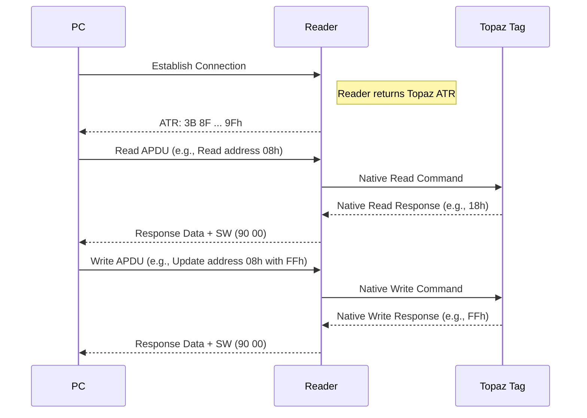

## Appendix B & C: APDU Flow Diagrams

### APDU Flow for ISO 14443-Compliant Tags

This diagram shows the general command and response flow for standard ISO 14443 tags.

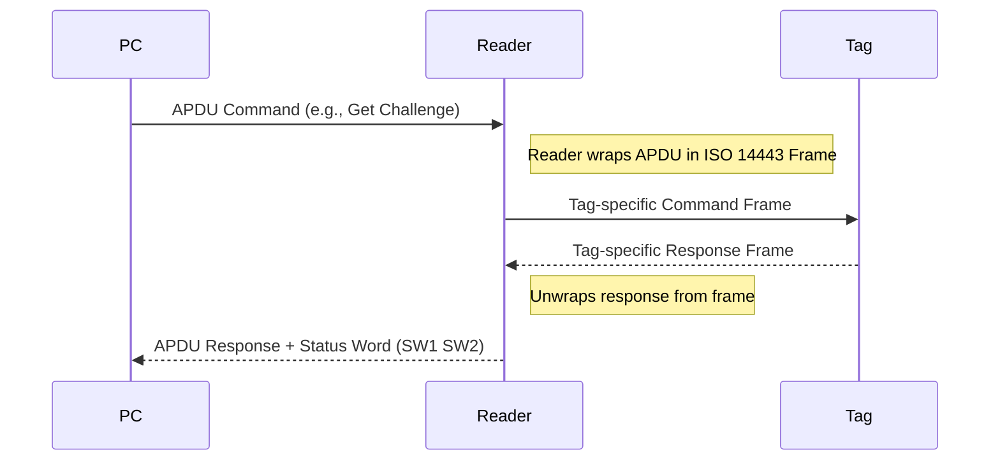

### APDU Flow for ISO 18092-Compliant Tags

This diagram illustrates how native commands for tags like Topaz are sent, either directly or wrapped in a Pseudo-APDU.

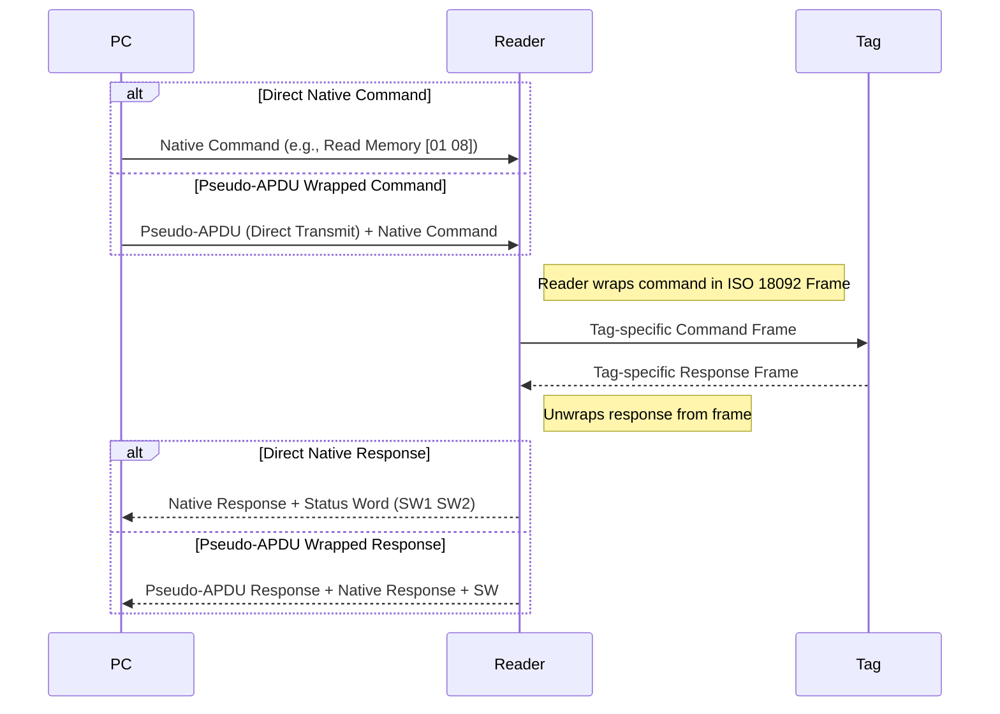

### NTAG424 EV2 Authentication Protocol

This diagram details the EV2 authentication handshake used by NTAG424 DNA.

```mermaid
sequenceDiagram
    participant Reader as NFC Reader
    participant Tag as NTAG424 Tag

    %% Phase 1: Challenge Request
    Reader->>Tag: AuthenticateEV2First
    note right of Reader
        C-APDU: 90 71 00 00 01 [KeyNo] 00
        KeyNo: 0x00-0x04
    end note
    Tag-->>Reader: Encrypted RndB + SW(91 AF)
    note left of Tag
        R-APDU: E(Kx, RndB) || 91 AF
        RndB: 16 random bytes
    end note

    %% Phase 2: Authentication Response
    Reader->>Tag: AuthenticateEV2Part2
    note right of Reader
        C-APDU: 90 AF 00 00 20 [E(Kx, RndA || rotl(RndB))] 00
        RndA: 16 random bytes generated by reader
        rotl(RndB): RndB rotated left by 1 byte
    end note
    Tag-->>Reader: Encrypted Response + SW(90 00)
    note left of Tag
        R-APDU: E(Kx, Ti || RndA' || PDcap || PCDcap) || 90 00
        Ti: Transaction Identifier
        RndA': RndA rotated by tag
    end note

    %% Session Key Derivation
    note over Reader
        Derive Session Keys:
        - SesAuthMACKey = CMAC(Kx, SV1 || 00...00)
        - SesEncKey = CMAC(Kx, SV2 || 00...00)
        Where:
        - SV1 = A5 5A 00 01 00 80 || RndA[0:2]
        - SV2 = 5A A5 00 01 00 80 || RndA[0:2]
    end note
```

### SDM Configuration Data Structure

This diagram shows the structure of the ChangeFileSettings command payload for SDM configuration.

```mermaid
packet
title "ChangeFileSettings SDM Payload"

0-7: "File Number"
8-15: "Communication Mode"
16-23: "Access Rights Byte 1"
24-31: "Access Rights Byte 2"
32-39: "SDM Options"
40-47: "PICC Data Offset Byte 1"
48-55: "PICC Data Offset Byte 2"
56-63: "PICC Data Offset Byte 3"
64-71: "MAC Input Offset Byte 1"
72-79: "MAC Input Offset Byte 2"
80-87: "MAC Input Offset Byte 3"
88-95: "MAC Offset Byte 1"
96-103: "MAC Offset Byte 2"
104-111: "MAC Offset Byte 3"
112-119: "Encrypted Data Offset Byte 1"
120-127: "Encrypted Data Offset Byte 2"
128-135: "Encrypted Data Offset Byte 3"
136-143: "Encrypted Data Length Byte 1"
144-151: "Encrypted Data Length Byte 2"
152-159: "Encrypted Data Length Byte 3"
160-167: "Read Counter Offset Byte 1"
168-175: "Read Counter Offset Byte 2"
176-183: "Read Counter Offset Byte 3"
```

### NDEF Message Structure with SDM Placeholders

This diagram shows how SDM placeholders are embedded in NDEF messages.

```mermaid
packet
title "NDEF Message with SDM Placeholders"

0-7: "T (03h)"
8-15: "L (Length)"
16-23: "Header (D1h)"
24-31: "Type Length (01h)"
32-39: "Payload Length"
40-47: "Type (55h = URI)"
48-55: "URI Prefix (04h = https://)"
56-63: "Base URL"
64-71: "?uid="
72-79: "{UID} Byte 1"
80-87: "{UID} Byte 2"
88-95: "{UID} Byte 3"
96-103: "{UID} Byte 4"
104-111: "{UID} Byte 5"
112-119: "{UID} Byte 6"
120-127: "{UID} Byte 7"
128-135: "&c="
136-143: "{CNT} Byte 1"
144-151: "{CNT} Byte 2"
152-159: "&mac="
160-167: "{MAC} Byte 1"
168-175: "{MAC} Byte 2"
176-183: "{MAC} Byte 3"
184-191: "{MAC} Byte 4"
192-199: "{MAC} Byte 5"
200-207: "{MAC} Byte 6"
208-215: "{MAC} Byte 7"
216-223: "{MAC} Byte 8"
224-231: "Terminator TLV (FEh)"
```
