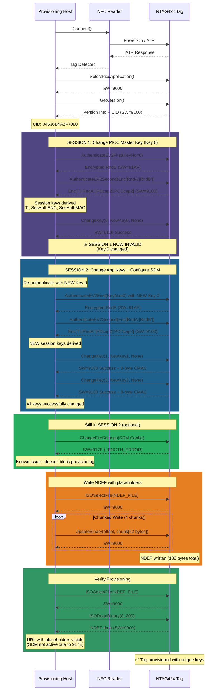
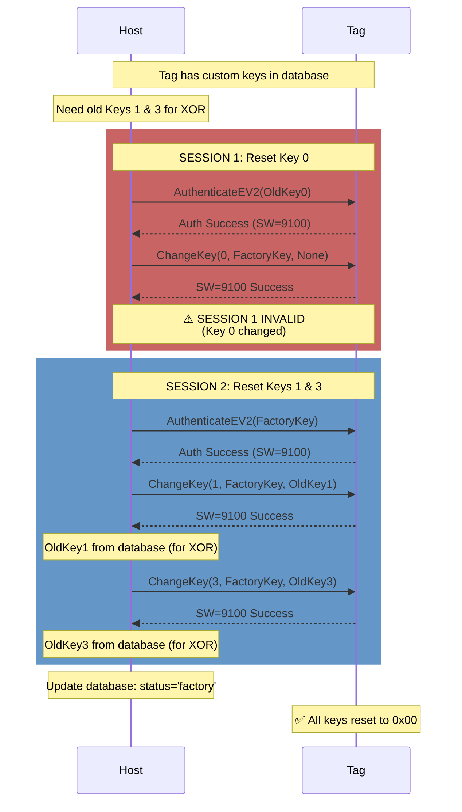
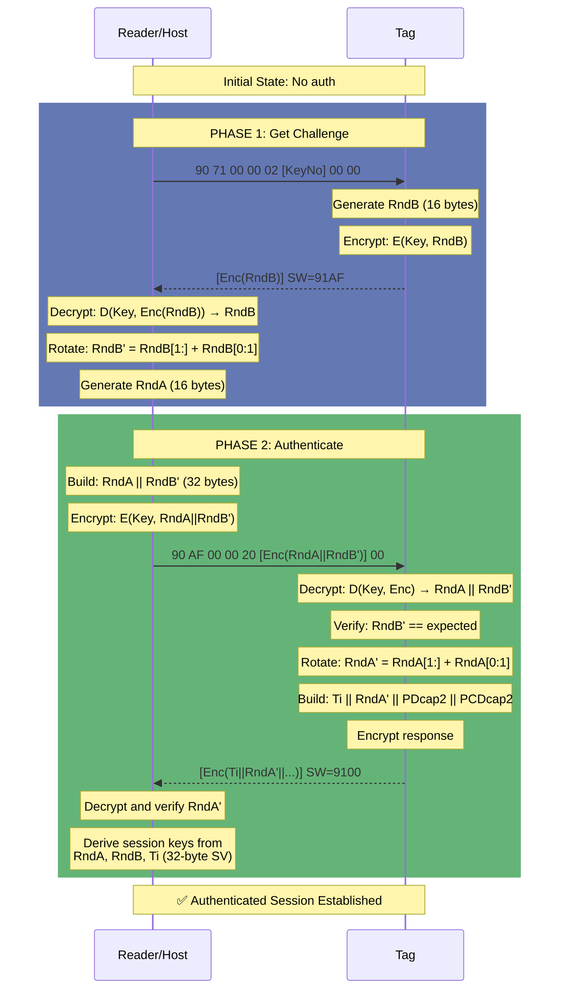
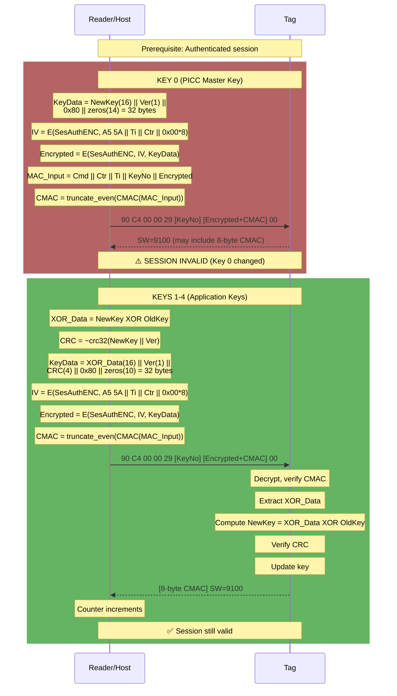
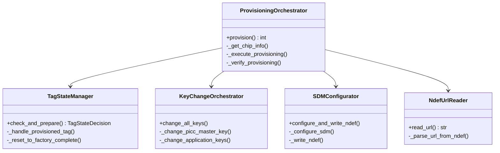
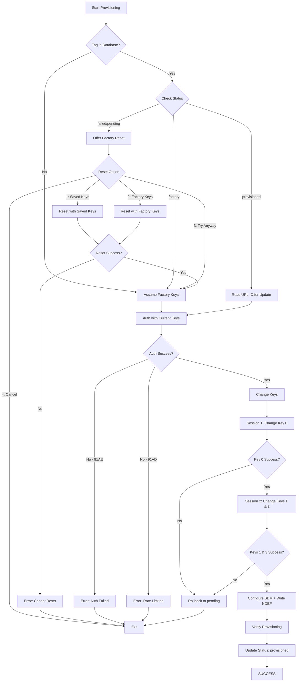
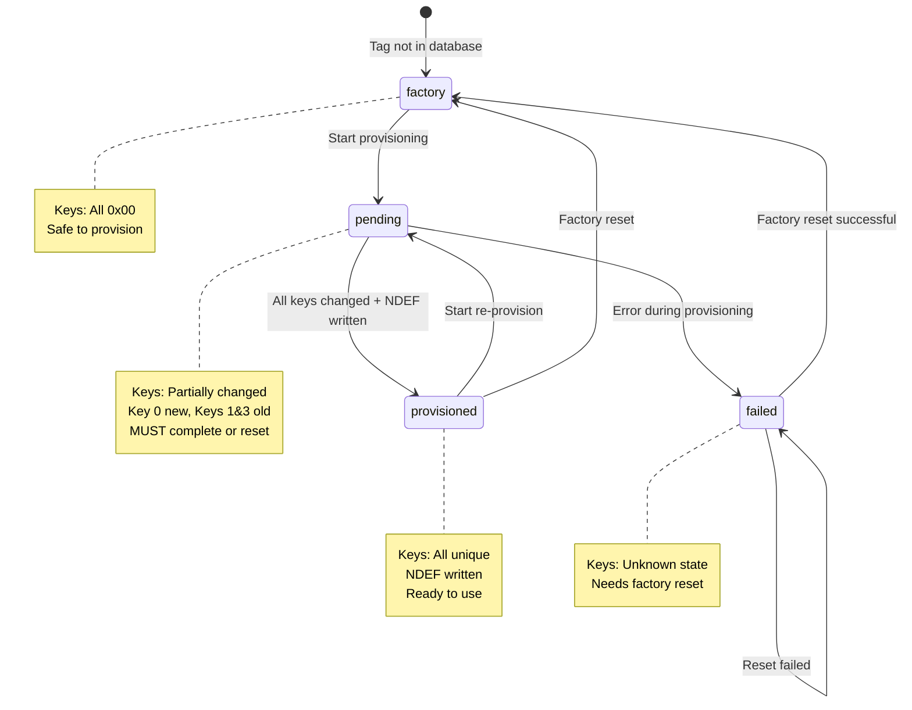
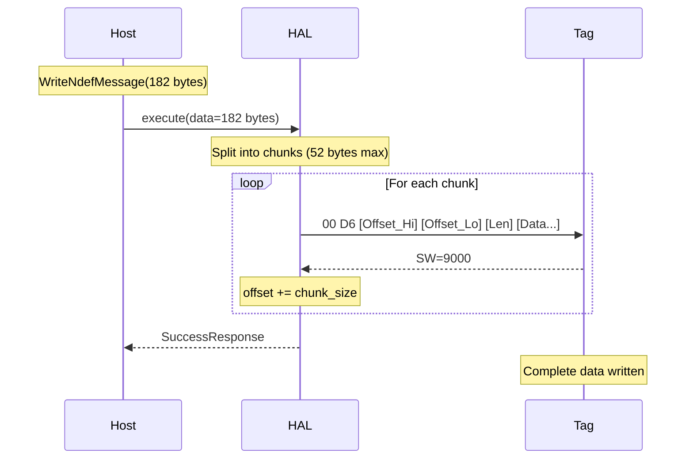

# NTAG424 DNA Provisioning - Sequence Diagrams

This document contains sequence diagrams showing the actual, verified provisioning flow based on successful execution traces.

---

## Complete Provisioning Sequence (Verified Working)

This diagram shows the ACTUAL working flow with two separate authentication sessions.



---

## Factory Reset Sequence (Verified Working)

Shows how to reset a provisioned tag back to factory defaults.



---

## EV2 Authentication Protocol (Detailed)



---

## ChangeKey Protocol (Detailed)



---

## Command Flow Patterns

### New Pattern (Preferred)
```python
# Unauthenticated commands
card.send(SelectPiccApplication())
version = card.send(GetChipVersion())
settings = card.send(GetFileSettings(file_no=2))

# Authenticated commands
with AuthenticateEV2(key, key_no=0)(card) as auth_conn:
    auth_conn.send(ChangeKey(0, new_key, None))
    auth_conn.send(ChangeKey(1, new_key, None))
```

### Old Pattern (Special Cases Only)
```python
# Commands with special APDU handling
WriteNdefMessage(data).execute(card)
ReadNdefMessage().execute(card)
```

---

## Status Word Reference

| Code | Name | Meaning |
|------|------|---------|
| 9000 | OK | Success (ISO standard) |
| 9100 | OK_ALTERNATIVE | Success (NTAG424 alternative) |
| 91AF | MORE_DATA_AVAILABLE | Additional frame available (Phase 1 success) |
| 91AE | AUTHENTICATION_ERROR | Auth failed or session invalid |
| 911E | INTEGRITY_ERROR | CMAC verification failed |
| 917E | LENGTH_ERROR | Incorrect data length |
| 91AD | AUTHENTICATION_DELAY | Rate limiting active (wait 60s) |
| 6982 | SECURITY_NOT_SATISFIED | Auth required for operation |

---

## Critical Insights

### Two-Session Requirement
Changing Key 0 invalidates the current session because Key 0 is the PICC Master Key that governs the authentication context. This is BY DESIGN for security.

**Consequence**: Must use two separate auth sessions:
1. Auth with old Key 0 → Change Key 0 → Session invalid
2. Auth with NEW Key 0 → Change Keys 1 & 3

**Why This Works**:
- After Step 1, Key 0 is changed
- Tag still knows Key 0 (just changed it)
- Can immediately re-auth with NEW Key 0
- Session 2 has full access to change remaining keys

### Why Old Keys Needed for Keys 1-4

For security, Keys 1-4 use XOR with old key:
```
TagVerification:
  Receive: (NewKey XOR OldKey) from PCD
  Compute: NewKey = (NewKey XOR OldKey) XOR OldKey
  Verify: CRC32 matches
  Update: Store NewKey
```

This prevents unauthorized key changes - attacker must know old key to compute valid XOR.

### Counter and IV Relationship

```
Before Command:
  Counter = N
  IV = E(SesAuthENC, A5 5A || Ti || N || zeros)
  CMAC_Input = Cmd || N || Ti || Data

After Success (SW=9100):
  Counter = N + 1

After Failure (SW != 9100):
  Counter = N (unchanged)
```

This ensures IV and CMAC use consistent counter value.

---

## Provisioning Script Architecture

The refactored `22_provision_game_coin.py` uses clean OOP:



**Design Principles**:
- Single Responsibility Principle
- Composition over inheritance
- DRY (no duplicated NDEF parsing)
- YAGNI (only abstractions we need)
- Testable (each class independently testable)

---

## Error Handling Flow



---

## Key Management States



---

## Chunked Write Protocol

For large data (>52 bytes), writes are chunked:



**Why Chunking**:
- Reader buffer limits (~64 bytes total APDU)
- Tag buffer limits
- Reliable transmission

**Chunk Size**: 52 bytes (safe default for ACR122U)

---

## References

- See `SUCCESSFUL_PROVISION_FLOW.md` for complete APDU traces
- See `MINDMAP.md` for architecture overview
- See `ARCH.md` for detailed class diagrams

**Last Updated**: 2025-11-08  
**Status**: ✅ Verified working end-to-end
