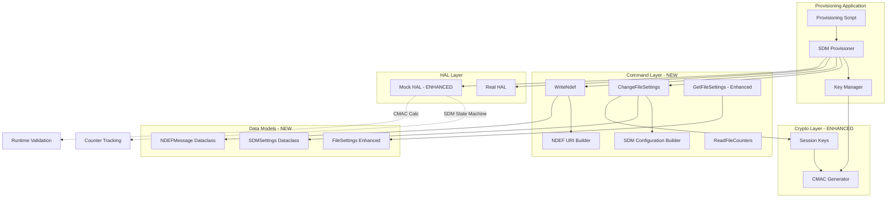
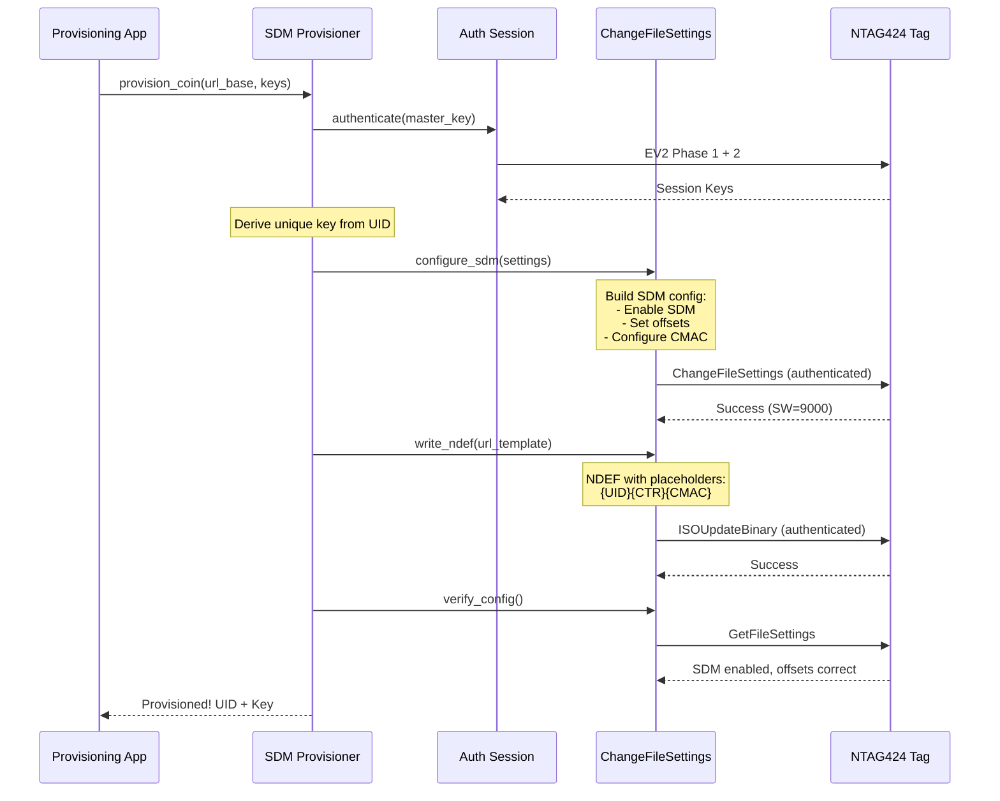

# SDM/SUN Provisioning Implementation Plan

**TLDR;** Complete implementation plan for provisioning NTAG424 DNA game coins with SUN (Secure Unique NFC) authentication. Uses SDM to generate tap-unique URLs with cryptographic authentication (CMAC) for server-side validation. No user authentication required - coins authenticate themselves.

---

## Executive Summary

### Goal
Implement complete SDM/SUN provisioning workflow that configures NTAG424 DNA game coins to generate tap-unique authenticated URLs for server-side validation.

### Target Use Case
- **Game coins** that authenticate themselves when tapped
- **No app required** - works with web backend only
- **Cross-platform** - Android automatic, iPhone XS+ automatic
- **Anti-counterfeiting** - CMAC proves authenticity
- **Replay protection** - Tap counter prevents URL reuse

### What Gets Provisioned
Each coin will be configured to output URLs like:
```
https://globalheadsandtails.com/tap?uid=04E12A3B4C5D60&ctr=000042&cmac=A1B2C3D4E5F67890
```

Where:
- `uid` = Coin's unique identifier (7 bytes, hex)
- `ctr` = Tap counter (24-bit, hex, increments each tap)
- `cmac` = AES-CMAC authentication code (8 bytes, hex)

---

## Architecture Overview

### Component Diagram



### Data Flow Sequence



---

## Requirements Breakdown

### User Story 1: Configure SDM on NDEF File
**As a** coin provisioner  
**I want to** configure SDM settings on the NDEF file  
**So that** the tag generates tap-unique URLs with CMAC authentication

**Acceptance Criteria:**
- [ ] Can authenticate with tag using factory or custom keys
- [ ] Can configure SDM with specific offsets for UID, counter, CMAC
- [ ] SDM uses a dedicated file read key for CMAC generation
- [ ] Can verify SDM configuration after applying
- [ ] Configuration persists across power cycles

**Technical Details:**
- Command: `ChangeFileSettings` (0x5F)
- File: 0x02 (NDEF file)
- SDM Options byte enables mirroring
- Must specify SDMMetaReadKey and SDMFileReadKey
- Offsets define where UID/counter/CMAC appear in URL

---

### User Story 2: Write NDEF URL Template
**As a** coin provisioner  
**I want to** write an NDEF URL with SDM placeholders  
**So that** the tag fills in dynamic values on each read

**Acceptance Criteria:**
- [ ] Can build valid NDEF URI record
- [ ] URL contains placeholders for UID (14 hex chars)
- [ ] URL contains placeholder for counter (6 hex chars)
- [ ] URL contains placeholder for CMAC (16 hex chars)
- [ ] NDEF message is properly formatted with TLV structure
- [ ] Can verify NDEF was written correctly

**Technical Details:**
- NDEF Type 4 Tag format
- URI record with http(s):// prefix
- Placeholders are ASCII-encoded hex positions
- Total NDEF size typically 64-128 bytes

---

### User Story 3: Derive Unique Keys Per Coin
**As a** coin provisioner  
**I want to** derive unique cryptographic keys from master key + UID  
**So that** each coin has different authentication credentials

**Acceptance Criteria:**
- [ ] Can derive 5 app keys from master key + UID
- [ ] Key derivation uses CMAC-based KDF
- [ ] Derived keys are deterministic (same UID = same keys)
- [ ] Can store/retrieve derived keys for verification
- [ ] Keys can be changed on tag using authenticated ChangeKey

**Technical Details:**
- Uses AES-CMAC KDF per NXP spec
- Input: Master Key || UID || Key Number
- Output: 16-byte AES-128 key
- All 5 app keys derived from single master

---

### User Story 4: Provision Complete Coin
**As a** coin provisioner  
**I want to** run a single command that fully provisions a coin  
**So that** I can efficiently set up coins for deployment

**Acceptance Criteria:**
- [ ] Single function call provisions entire coin
- [ ] Returns coin UID + derived keys for database storage
- [ ] Handles authentication automatically
- [ ] Configures both SDM and writes NDEF in one flow
- [ ] Provides clear error messages if any step fails
- [ ] Can optionally verify provisioning was successful

**Technical Details:**
- High-level API wrapper
- Orchestrates: auth → derive keys → change keys → configure SDM → write NDEF
- Returns structured result with all relevant data

---

### User Story 5: Verify Server-Side CMAC
**As a** game server  
**I want to** verify CMAC from tapped coins  
**So that** I can authenticate coins and prevent counterfeits

**Acceptance Criteria:**
- [ ] Can calculate expected CMAC from UID + counter + key
- [ ] CMAC algorithm matches tag implementation
- [ ] Can validate CMAC from query parameters
- [ ] Can track counters to prevent replay attacks
- [ ] Provides clear validation result (valid/invalid/replay)

**Technical Details:**
- Server-side helper functions
- Uses same AES-CMAC as tag
- Input: UID || Counter || URL portion
- Compares with CMAC from URL

---

### User Story 6: Test with Mock HAL
**As a** developer  
**I want to** test SDM provisioning without physical tags  
**So that** I can develop and test efficiently

**Acceptance Criteria:**
- [ ] Mock HAL simulates SDM configuration
- [ ] Mock generates realistic CMAC values
- [ ] Mock increments counter on each read
- [ ] Mock supports full provisioning workflow
- [ ] Test suite validates all provisioning steps

**Technical Details:**
- Extend existing MockCardConnection
- Add SDM state machine
- Implement CMAC calculation
- Track counter per simulated tag

---

## Implementation Components

### 1. New APDU Commands

#### `ChangeFileSettings` (Command 0x5F)
```python
class ChangeFileSettings(ApduCommand):
    """
    Changes file settings including SDM configuration.
    Must be authenticated with appropriate key.
    """
    def __init__(self, file_no: int, settings: FileSettings):
        # CLA=90, INS=5F, P1=00, P2=00
        # Data: FileNo + FileOption + AccessRights + SDM Options
```

#### `GetFileCounters` (Command 0xC1)
```python
class GetFileCounters(ApduCommand):
    """
    Retrieves SDM read counter for a file.
    Used to verify counter incrementing.
    """
    def __init__(self, file_no: int):
        # CLA=90, INS=C1, P1=00, P2=00, Data: FileNo
```

#### `WriteNdefWithSDM` (Enhanced)
```python
class WriteNdefWithSDM(ApduCommand):
    """
    Writes NDEF message with SDM placeholders.
    Builds proper NDEF structure with URI record.
    """
    def __init__(self, url_base: str, sdm_settings: SDMSettings):
        # Builds NDEF with placeholders at correct offsets
```

### 2. New Dataclasses

#### `SDMSettings`
```python
@dataclass
class SDMSettings:
    """Configuration for Secure Dynamic Messaging"""
    enable_uid_mirror: bool = True
    enable_counter_mirror: bool = True
    enable_cmac: bool = True
    
    # Offsets in NDEF file where data is mirrored
    picc_data_offset: int = 0  # UID mirror position
    sdm_mac_input_offset: int = 0  # Where CMAC calculation starts
    sdm_mac_offset: int = 0  # Where CMAC appears in URL
    
    # Key configuration
    sdm_meta_read_key_no: int = 0x01  # Key for UID encryption
    sdm_file_read_key_no: int = 0x02  # Key for CMAC
    
    # Access rights
    read_key: int = 0x0E  # Free read
    write_key: int = 0x00  # Requires key 0
    read_write_key: int = 0x00  # Requires key 0
    change_key: int = 0x00  # Requires key 0
    
    def __str__(self) -> str:
        return f"""SDMSettings(
    UID Mirror: {self.enable_uid_mirror}
    Counter Mirror: {self.enable_counter_mirror}
    CMAC: {self.enable_cmac}
    Offsets: PICC={self.picc_data_offset}, MAC={self.sdm_mac_offset}
    Keys: MetaRead=#{self.sdm_meta_read_key_no}, FileRead=#{self.sdm_file_read_key_no}
)"""
```

#### `FileSettings` (Enhanced)
```python
@dataclass
class FileSettings:
    """Enhanced to include SDM configuration"""
    file_type: int
    file_option: int
    access_rights: bytes  # 4 bytes
    
    # SDM specific
    sdm_enabled: bool = False
    sdm_options: Optional[int] = None
    sdm_access_rights: Optional[bytes] = None
    picc_data_offset: Optional[int] = None
    sdm_mac_input_offset: Optional[int] = None
    sdm_mac_offset: Optional[int] = None
    
    def __str__(self) -> str:
        base = f"FileSettings(type=0x{self.file_type:02X}, option=0x{self.file_option:02X})"
        if self.sdm_enabled:
            return f"{base}\n  SDM: Enabled (offsets: PICC={self.picc_data_offset}, MAC={self.sdm_mac_offset})"
        return base
```

#### `NDEFMessage`
```python
@dataclass
class NDEFMessage:
    """NDEF message structure"""
    url: str
    record_type: str = "U"  # URI
    
    def to_bytes(self) -> bytes:
        """Build complete NDEF TLV structure"""
        # Implements NDEF Type 4 Tag spec
        
    def __str__(self) -> str:
        return f"NDEFMessage(url={self.url[:50]}...)"
```

#### `ProvisioningResult`
```python
@dataclass
class ProvisioningResult:
    """Result of coin provisioning"""
    uid: bytes
    derived_keys: Dict[int, bytes]  # Key number -> key
    url_template: str
    sdm_settings: SDMSettings
    counter_value: int
    provisioned_at: str  # ISO timestamp
    
    def __str__(self) -> str:
        return f"""ProvisioningResult:
    UID: {self.uid.hex().upper()}
    Keys Provisioned: {len(self.derived_keys)}
    URL Template: {self.url_template}
    Counter: {self.counter_value}
    Timestamp: {self.provisioned_at}
"""
    
    def to_dict(self) -> dict:
        """For database storage"""
        return {
            'uid': self.uid.hex(),
            'keys': {k: v.hex() for k, v in self.derived_keys.items()},
            'url_template': self.url_template,
            'counter': self.counter_value,
            'timestamp': self.provisioned_at
        }
```

### 3. New Constants

```python
# SDM/SUN specific command codes
CMD_CHANGE_FILE_SETTINGS = 0x5F
CMD_GET_FILE_COUNTERS = 0xC1

# File numbers
FILE_CC = 0x01  # Capability Container
FILE_NDEF = 0x02  # NDEF file (SDM capable)
FILE_PROPRIETARY = 0x03  # Extra data file

# SDM Options byte flags
SDM_OPT_UID_MIRROR = 0x80
SDM_OPT_COUNTER_MIRROR = 0x40
SDM_OPT_READ_CTR_LIMIT = 0x20
SDM_OPT_ENC_FILE_DATA = 0x10
SDM_OPT_TT_STATUS = 0x08  # Tag Tamper status

# Communication modes
COMM_MODE_PLAIN = 0x00
COMM_MODE_MAC = 0x01
COMM_MODE_FULL = 0x03

# Access rights special values
ACCESS_FREE = 0x0E
ACCESS_NEVER = 0x0F

# NDEF constants
NDEF_FILE_SIZE = 256  # bytes
NDEF_TLV_TYPE = 0x03  # NDEF message TLV
NDEF_TERM_TLV = 0xFE  # Terminator TLV

# URL encoding
URI_PREFIX_HTTPS = 0x04  # "https://"
URI_PREFIX_HTTP = 0x03   # "http://"
```

### 4. Helper Functions

#### SDM Configuration Builder
```python
def build_sdm_config(
    url_base: str,
    enable_encryption: bool = False
) -> Tuple[SDMSettings, str]:
    """
    Builds SDM configuration and URL template with proper offsets.
    
    Args:
        url_base: Base URL (e.g., "https://globalheadsandtails.com/tap")
        enable_encryption: Encrypt UID mirror
    
    Returns:
        (SDMSettings, url_template)
        
    Example:
        settings, template = build_sdm_config("https://example.com/tap")
        # template = "https://example.com/tap?uid=00000000000000&ctr=000000&cmac=0000000000000000"
        # settings.picc_data_offset points to UID position
    """
```

#### CMAC Calculator
```python
def calculate_sdm_cmac(
    key: bytes,
    uid: bytes,
    counter: int,
    url_portion: bytes
) -> bytes:
    """
    Calculates SDM CMAC exactly as tag does.
    
    Args:
        key: 16-byte SDMFileReadKey
        uid: 7-byte tag UID
        counter: 24-bit read counter
        url_portion: Part of URL included in MAC
    
    Returns:
        8-byte CMAC (truncated to 8 from 16)
    """
```

#### Server-Side Validator
```python
def validate_sun_url(
    url: str,
    master_key: bytes,
    counter_db: Dict[str, int]
) -> Tuple[bool, str, Dict]:
    """
    Validates a SUN URL from a tapped coin.
    
    Args:
        url: Full URL with uid, ctr, cmac parameters
        master_key: Master key to derive coin's key
        counter_db: Database of last seen counters per UID
    
    Returns:
        (is_valid, message, details)
        
    Example:
        valid, msg, info = validate_sun_url(
            "https://example.com/tap?uid=04...&ctr=42&cmac=A1B2...",
            MASTER_KEY,
            counter_db
        )
        if valid:
            print(f"Valid coin {info['uid']}, tap #{info['counter']}")
    """
```

### 5. Enhanced Mock HAL

```python
class MockCardConnection:
    """Enhanced mock to simulate SDM behavior"""
    
    def __init__(self):
        self.sdm_config: Optional[SDMSettings] = None
        self.sdm_counter: int = 0
        self.ndef_data: bytes = b""
        self.keys: Dict[int, bytes] = {
            0: KEY_DEFAULT_FACTORY,
            1: KEY_DEFAULT_FACTORY,
            2: KEY_DEFAULT_FACTORY,
            3: KEY_DEFAULT_FACTORY,
            4: KEY_DEFAULT_FACTORY,
        }
    
    def _handle_change_file_settings(self, apdu: List[int]) -> Tuple[List[int], int, int]:
        """Simulates ChangeFileSettings with SDM parsing"""
        
    def _handle_read_ndef_with_sdm(self) -> bytes:
        """
        Simulates SDM: replaces placeholders with dynamic values.
        - UID mirror at picc_data_offset
        - Counter at counter_offset
        - CMAC at sdm_mac_offset
        """
        
    def _generate_sdm_cmac(self, uid: bytes, counter: int) -> bytes:
        """Calculates CMAC using SDMFileReadKey"""
```

---

## Implementation Phases

### Phase 1: Core SDM Commands (Week 1)
**Goal:** Implement basic SDM configuration commands

**Tasks:**
1. Implement `ChangeFileSettings` command class
   - APDU construction with SDM options
   - Authenticated command (uses session keys)
   - Parse and validate settings

2. Enhance `GetFileSettings` to parse SDM options
   - Add SDM fields to FileSettings dataclass
   - Pretty-print SDM configuration

3. Implement `GetFileCounters` command
   - Read SDM counter value
   - Verify counter increments

4. Add SDM-specific constants and enums

**Acceptance Tests:**
```python
def test_configure_sdm_basic():
    """Configure SDM with UID and counter mirroring"""
    
def test_configure_sdm_with_cmac():
    """Configure SDM with CMAC authentication"""
    
def test_read_file_settings_sdm():
    """Verify SDM settings after configuration"""
    
def test_read_counter():
    """Read and verify SDM counter"""
```

---

### Phase 2: NDEF URL Building (Week 1)
**Goal:** Generate proper NDEF messages with SDM placeholders

**Tasks:**
1. Implement NDEF message builder
   - Type 4 Tag TLV structure
   - URI record format
   - Placeholder positioning

2. Create SDM configuration calculator
   - Calculate offsets based on URL structure
   - Validate offset constraints
   - Generate URL template

3. Implement NDEF writing with placeholders
   - WriteData or ISOUpdateBinary
   - Verify write succeeded
   - Read back and validate

**Acceptance Tests:**
```python
def test_build_ndef_url():
    """Build NDEF with proper structure"""
    
def test_calculate_sdm_offsets():
    """Offsets align with URL structure"""
    
def test_write_ndef_with_placeholders():
    """Write and verify NDEF template"""
```

---

### Phase 3: Key Management Interface (Week 2) - STUBBED
**Goal:** Define key management interface for later implementation

**Tasks:**
1. Create KeyManager interface/protocol
   - `get_key(uid: bytes, key_no: int) -> bytes`
   - Simple abstraction for key retrieval
   - Implementation deferred

2. Implement SimpleKeyManager (temporary)
   - Uses factory keys for all coins
   - Simplifies initial development
   - Easy to replace later

3. Implement ChangeKey command (optional for now)
   - Authenticated key change
   - Needed only when using unique keys per coin

**Acceptance Tests:**
```python
def test_simple_key_manager():
    """SimpleKeyManager returns factory keys"""
    
def test_key_manager_interface():
    """Interface contract validated"""
```

**Note:** Full key derivation (CMAC-based KDF) will be implemented later when needed.

---

### Phase 4: CMAC Calculation (Week 2)
**Goal:** Implement CMAC generation matching tag

**Tasks:**
1. Implement SDM CMAC algorithm
   - AES-CMAC over UID || Counter || URL
   - Truncate to 8 bytes
   - Match NXP specification

2. Create server-side validation helpers
   - Parse URL parameters
   - Calculate expected CMAC
   - Compare and validate

3. Implement counter tracking
   - Database/dict of last seen counters
   - Detect replay attacks

**Acceptance Tests:**
```python
def test_calculate_cmac():
    """CMAC matches expected value"""
    
def test_validate_sun_url():
    """Server validates genuine URL"""
    
def test_detect_replay():
    """Reject previously-seen counter"""
```

---

### Phase 5: Mock HAL Enhancement (Week 3)
**Goal:** Complete simulation of SDM behavior

**Tasks:**
1. Add SDM state machine to MockCardConnection
   - Track SDM configuration
   - Simulate counter incrementing
   - Generate dynamic responses

2. Implement mock SDM read
   - Replace placeholders with values
   - Calculate CMAC
   - Increment counter

3. Add validation helpers
   - Verify provisioning succeeded
   - Check NDEF format
   - Validate CMAC

**Acceptance Tests:**
```python
def test_mock_sdm_read():
    """Mock returns dynamic URL"""
    
def test_mock_counter_increments():
    """Counter increases on each read"""
    
def test_mock_cmac_valid():
    """Mock CMAC passes validation"""
```

---

### Phase 6: Complete Provisioning Workflow (Week 3)
**Goal:** End-to-end coin provisioning

**Tasks:**
1. Implement high-level provisioner class
   - Orchestrates full workflow
   - Error handling and recovery
   - Returns structured result

2. Create provisioning script
   - CLI tool for provisioning
   - Batch mode support
   - Output CSV/JSON for database

3. Add verification mode
   - Test provisioned coin
   - Simulate tap and validate
   - Generate test URLs

**Acceptance Tests:**
```python
def test_provision_complete_coin():
    """Full provisioning workflow"""
    
def test_verify_provisioned_coin():
    """Verification after provisioning"""
    
def test_batch_provision():
    """Provision multiple coins"""
```

---

### Phase 7: Server-Side Integration (Week 4)
**Goal:** Server validation and examples

**Tasks:**
1. Create Flask/FastAPI example endpoint
   - Receive tap URLs
   - Validate CMAC
   - Track counters
   - Return JSON response

2. Implement counter database
   - SQLite for demo
   - Track UID → last counter
   - Detect replays

3. Create example game coin integration
   - Redeem coin for reward
   - One-time use enforcement
   - User-friendly error messages

**Deliverables:**
- `examples/server_validation.py` - Server endpoint
- `examples/coin_database.py` - Counter tracking
- `examples/game_integration.py` - Full example

---

## Testing Strategy

### Unit Tests (Per Component)
- Each APDU command
- Each dataclass
- Each helper function
- CMAC calculation
- Key derivation

### Integration Tests (Workflows)
- Authenticate → Configure SDM
- Configure SDM → Write NDEF
- Full provisioning flow
- Read with SDM → Validate

### Mock HAL Tests
- All tests run with `USE_MOCK_HAL=1`
- No physical tags needed during development
- CI/CD friendly

### Hardware Validation Tests
- Final validation on real tags
- Compare mock vs real behavior
- Edge cases and error conditions

---

## Success Metrics

### Functional
- [ ] Can provision coin in <5 seconds
- [ ] Generated URLs validate server-side
- [ ] Counter increments correctly
- [ ] CMAC prevents counterfeiting
- [ ] Works on Android and iOS

### Code Quality
- [ ] >90% test coverage
- [ ] All tests pass with mock HAL
- [ ] Clean API with type hints
- [ ] Comprehensive docstrings
- [ ] Pretty-printed output

### Documentation
- [ ] Complete API documentation
- [ ] Provisioning guide
- [ ] Server integration guide
- [ ] Troubleshooting guide

---

## File Structure

```
src/ntag424_sdm_provisioner/
├── commands/
│   ├── sdm_commands.py          # Enhanced with new commands
│   ├── sdm_helpers.py           # SDM config builders
│   └── sun_commands.py          # Deprecated/merged
├── crypto/
│   ├── auth_session.py          # Existing EV2 auth
│   └── cmac_validator.py        # NEW: Server-side validation
├── key_manager_interface.py     # NEW: Key management interface (STUBBED)
├── constants.py                 # Enhanced with SDM constants
├── provisioner.py               # NEW: High-level API
└── server/                      # NEW: Server-side helpers
    ├── validator.py
    └── counter_db.py

examples/
├── 20_provision_game_coin.py    # NEW: Complete provisioning
├── 21_batch_provision.py        # NEW: Batch mode
├── 22_verify_provisioned.py    # NEW: Test provisioning
└── server/                      # NEW: Server examples
    ├── validate_endpoint.py
    └── game_integration.py

tests/
├── ntag424_sdm_provisioner/
│   ├── mock_hal.py              # Enhanced with SDM
│   ├── test_sdm_commands.py     # NEW
│   ├── test_provisioning.py     # NEW
│   └── test_server_validation.py # NEW
```

---

## Risk Mitigation

### Risk: SDM Configuration Complexity
**Mitigation:** 
- Start with simple UID+Counter only
- Add CMAC once basic mirroring works
- Helper functions abstract complexity

### Risk: CMAC Algorithm Mismatch
**Mitigation:**
- Test against known good values from NXP docs
- Validate with real tag early
- Mock returns same values as real tag

### Risk: Offset Calculation Errors
**Mitigation:**
- Automated calculation based on URL
- Validation checks before writing
- Test with various URL lengths

### Risk: Counter Synchronization
**Mitigation:**
- Server tracks last seen counter
- Reject backwards movement
- Allow counter resets with admin approval

---

## Dependencies

### Existing
- ✅ pycryptodome (AES, CMAC)
- ✅ pyscard (PC/SC communication)
- ✅ EV2 authentication working
- ✅ Mock HAL infrastructure

### New (Optional)
- Flask/FastAPI (server examples)
- SQLite (counter database)
- pytest-mock (enhanced testing)

---

## Timeline

| Phase | Duration | Dependencies | Deliverable |
|-------|----------|--------------|-------------|
| 1. Core SDM Commands | 3 days | Auth working | ChangeFileSettings, GetFileCounters |
| 2. NDEF Building | 2 days | Phase 1 | NDEF with placeholders |
| 3. Key Management | 3 days | Auth working | Key derivation, ChangeKey |
| 4. CMAC Calculation | 2 days | Phase 2, 3 | Server validation |
| 5. Mock HAL Enhancement | 2 days | Phase 1-4 | Full simulation |
| 6. Complete Workflow | 3 days | Phase 1-5 | Provisioning tool |
| 7. Server Integration | 2 days | Phase 4, 6 | Example server |

**Total: ~3 weeks**

---

## Next Steps

1. **Review this plan** - Confirm approach and scope
2. **Start Phase 1** - Implement core SDM commands
3. **Iterate rapidly** - Use mock HAL for fast feedback
4. **Validate early** - Test on real tag by end of Phase 2
5. **Document as you go** - Keep examples updated

---

**Status:** Ready for implementation  
**Last Updated:** 2025-11-01  
**Owner:** Development Team

